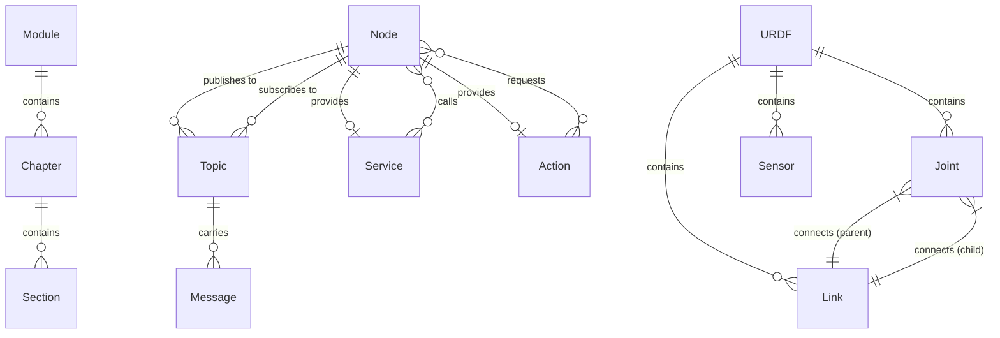

# Data Model: Module 1 – The Robotic Nervous System (ROS 2)

**Feature**: 001-module1-ros2
**Date**: 2025-12-18

## Purpose

This document defines the conceptual entities and relationships for Module 1. Since this is educational content (not a software system), the "data model" describes the **learning artifacts** and **conceptual entities** taught to learners, rather than database schemas or API contracts.

## Conceptual Entities (Learning Content)

These are the core concepts that learners will understand after completing Module 1.

### 1. ROS 2 Node

**Definition**: A computational process that performs a specific task in a robot system.

**Key Attributes**:
- Name: Unique identifier (e.g., `vision_processor`, `motion_controller`)
- Responsibility: Single, well-defined task (sensor processing, motion planning, etc.)
- Communication interfaces: Publishers, subscribers, services, actions

**Relationships**:
- Publishes to → Topics (one-to-many)
- Subscribes to → Topics (one-to-many)
- Provides → Services (one-to-many)
- Calls → Services (one-to-many)

**Examples**:
- `/camera_node`: Publishes image data
- `/vision_ai_node`: Subscribes to images, publishes object detections
- `/motion_controller`: Subscribes to motion commands, controls actuators

---

### 2. Topic

**Definition**: A named communication bus for asynchronous, many-to-many message passing.

**Key Attributes**:
- Name: Hierarchical path (e.g., `/camera/image`, `/cmd_vel`, `/joint_states`)
- Message type: Data structure schema (e.g., `sensor_msgs/Image`, `geometry_msgs/Twist`)
- Publishers: Nodes that write to this topic
- Subscribers: Nodes that read from this topic

**Relationships**:
- Published by → Nodes (many-to-many)
- Subscribed by → Nodes (many-to-many)
- Carries → Messages (one-to-many, over time)

**Examples**:
- `/camera/image`: Camera node → Vision AI node
- `/cmd_vel`: AI decision node → Motion controller
- `/joint_states`: Robot hardware → Monitoring dashboard

---

### 3. Service

**Definition**: A synchronous request-response communication pattern for discrete operations.

**Key Attributes**:
- Name: Operation identifier (e.g., `/compute_ik`, `/reset_pose`)
- Request type: Input data structure
- Response type: Output data structure
- Provider: Node that implements the service
- Clients: Nodes that call the service

**Relationships**:
- Provided by → Node (one-to-one)
- Called by → Nodes (one-to-many)

**Examples**:
- `/compute_ik`: Input = desired position, Output = joint angles
- `/reset_pose`: Input = none, Output = success/failure

---

### 4. Action

**Definition**: A long-running task with feedback and preemption support.

**Key Attributes**:
- Name: Task identifier (e.g., `/navigate_to_pose`, `/grasp_object`)
- Goal type: Desired outcome
- Feedback type: Progress updates
- Result type: Final outcome
- Provider: Node that executes the action
- Clients: Nodes that request the action

**Relationships**:
- Provided by → Node (one-to-one)
- Requested by → Nodes (one-to-many)

**Examples**:
- `/navigate_to_pose`: Goal = target coordinates, Feedback = distance remaining, Result = success/failure
- `/grasp_object`: Goal = object ID, Feedback = gripper state, Result = grasped or failed

---

### 5. Message

**Definition**: A data structure transmitted over topics.

**Key Attributes**:
- Type: Standard ROS 2 message (e.g., `sensor_msgs/Image`, `std_msgs/String`)
- Fields: Data members (e.g., `header`, `data`, `timestamp`)

**Relationships**:
- Published to → Topic (many-to-one)
- Consumed by → Subscribers (one-to-many)

**Examples**:
- `sensor_msgs/Image`: Contains image data, encoding, dimensions
- `geometry_msgs/Twist`: Contains linear and angular velocity
- `sensor_msgs/JointState`: Contains joint names, positions, velocities

---

### 6. URDF (Unified Robot Description Format)

**Definition**: An XML file defining a robot's structure, appearance, and physics properties.

**Key Attributes**:
- Filename: Robot model identifier (e.g., `humanoid.urdf`, `arm_robot.urdf`)
- Links: List of rigid body parts
- Joints: List of connections between links
- Sensors: List of sensor definitions
- Visual/Collision geometry: Appearance and physics shapes

**Relationships**:
- Contains → Links (one-to-many)
- Contains → Joints (one-to-many)
- Contains → Sensors (one-to-many)

**Examples**:
- Humanoid URDF: Torso, arms, legs, head as links; shoulder, elbow, hip, knee as joints
- Sensor definitions: Camera link, IMU link

---

### 7. Link (URDF)

**Definition**: A rigid body part in a robot's URDF description.

**Key Attributes**:
- Name: Link identifier (e.g., `torso`, `upper_arm`, `forearm`)
- Visual: Appearance in simulation (mesh file or primitive shape)
- Collision: Physics collision shape
- Inertial: Mass and inertia properties (omitted in conceptual content)

**Relationships**:
- Connected to → Links via Joints (many-to-many)
- Part of → URDF (many-to-one)

**Examples**:
- `torso`: Root link of humanoid
- `upper_arm`: Connected to torso via shoulder joint
- `camera_link`: Holds camera sensor

---

### 8. Joint (URDF)

**Definition**: A connection between two links with motion constraints.

**Key Attributes**:
- Name: Joint identifier (e.g., `shoulder_joint`, `elbow_joint`)
- Type: Motion type (`revolute`, `prismatic`, `fixed`, `continuous`, `floating`, `planar`)
- Parent link: Fixed link
- Child link: Moving link
- Axis: Rotation or translation direction (for revolute/prismatic)
- Limits: Motion range (lower/upper bounds)

**Relationships**:
- Connects → Links (parent-child, one-to-one for each role)
- Part of → URDF (many-to-one)

**Examples**:
- `shoulder_joint`: Revolute, connects torso to upper_arm, rotates around Z axis, limits ±90 degrees
- `elbow_joint`: Revolute, connects upper_arm to forearm, limits 0-150 degrees
- `base_joint`: Fixed, connects world to robot base (no motion)

---

## Content Structure Entities

These entities represent the organization of the learning content itself.

### 9. Module

**Definition**: A cohesive learning unit covering a major topic.

**Key Attributes**:
- Number: Module identifier (e.g., Module 1, Module 2)
- Title: Module name (e.g., "The Robotic Nervous System")
- Chapters: List of sub-topics
- Learning objectives: High-level outcomes

**Relationships**:
- Contains → Chapters (one-to-many)
- Part of → Book (many-to-one)

**Example**:
- Module 1: ROS 2 Nervous System (3 chapters)

---

### 10. Chapter

**Definition**: A focused lesson within a module.

**Key Attributes**:
- Number: Chapter identifier within module (e.g., Chapter 1, Chapter 2)
- Title: Chapter name (e.g., "ROS 2 Fundamentals")
- Content: Markdown text, diagrams, code snippets
- Estimated reading time: 15-25 minutes
- Priority: Learning sequence (P1, P2, P3)

**Relationships**:
- Part of → Module (many-to-one)
- Contains → Sections (one-to-many)

**Examples**:
- Chapter 1: ROS 2 Fundamentals (P1) – nodes, topics, services, actions
- Chapter 2: Python Agents with rclpy (P2) – publishers, subscribers, AI control
- Chapter 3: Humanoid Robot Description (P3) – URDF, links, joints

---

## Entity Relationship Diagram

---

## Notes

- **No database**: This is educational content; no persistent storage required
- **No APIs**: Content is static Markdown files
- **No state management**: Each chapter is stateless; learners progress linearly

This data model serves as a **conceptual reference** for content authors to ensure consistency and completeness when writing Module 1 chapters.
