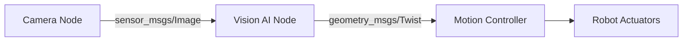

# Quickstart: Module 1 – The Robotic Nervous System (ROS 2)

**Feature**: 001-module1-ros2
**Date**: 2025-12-18
**Target**: Content authors and developers working on Module 1

## Purpose

This quickstart guide enables content authors to set up the development environment and author Module 1 content for the Physical AI Book. It covers Docusaurus initialization, content structure creation, and validation workflows.

---

## Prerequisites

- **Node.js**: Version 18.0 or higher ([download](https://nodejs.org/))
- **npm**: Comes with Node.js (verify with `npm --version`)
- **Git**: Version control ([download](https://git-scm.com/))
- **Text editor**: VS Code recommended ([download](https://code.visualstudio.com/))

**Assumed Knowledge**:
- Basic Markdown syntax
- Command-line usage (terminal/shell)
- Git basics (clone, commit, push)

---

## Step 1: Clone Repository

```bash
git clone https://github.com/[your-org]/physical-ai-book.git
cd physical-ai-book
```

*Replace `[your-org]` with actual GitHub organization/username.*

---

## Step 2: Initialize Docusaurus (If Not Already Done)

If this is the first time setting up the project:

```bash
# Install Docusaurus
npx create-docusaurus@latest website classic

# Move into Docusaurus directory
cd website

# Install Mermaid plugin for diagrams
npm install --save @docusaurus/theme-mermaid
```

**Configure Mermaid** in `docusaurus.config.js`:

```javascript
module.exports = {
  // ... existing config
  themeConfig: {
    mermaid: {
      theme: {light: 'neutral', dark: 'forest'},
    },
  },
  markdown: {
    mermaid: true,
  },
  themes: ['@docusaurus/theme-mermaid'],
};
```

---

## Step 3: Create Module 1 Directory Structure

```bash
# Navigate to docs directory
cd website/docs

# Create Module 1 directory
mkdir -p module1-ros2-nervous-system

# Create chapter files
touch module1-ros2-nervous-system/index.md
touch module1-ros2-nervous-system/01-ros2-fundamentals.md
touch module1-ros2-nervous-system/02-python-rclpy.md
touch module1-ros2-nervous-system/03-urdf-humanoids.md

# Create sidebar category config
touch module1-ros2-nervous-system/_category_.json
```

---

## Step 4: Configure Sidebar

Edit `module1-ros2-nervous-system/_category_.json`:

```json
{
  "label": "Module 1: The Robotic Nervous System",
  "position": 2,
  "link": {
    "type": "generated-index",
    "description": "Learn how ROS 2 connects AI software to humanoid robot bodies."
  }
}
```

---

## Step 5: Author Module 1 Introduction

Edit `module1-ros2-nervous-system/index.md`:

```markdown
---
sidebar_position: 1
title: Module 1 Overview
---

# Module 1: The Robotic Nervous System (ROS 2)

## What You'll Learn

This module teaches AI engineers how ROS 2 serves as the "nervous system" of a robot, enabling communication between AI software (the "brain") and physical hardware (the "body").

**By the end of this module, you will**:
- Understand ROS 2 architecture (nodes, topics, services, actions)
- Read and explain Python code using rclpy for AI control
- Interpret URDF files that define humanoid robot structure

## Prerequisites

- Basic Python programming (functions, classes, callbacks)
- Familiarity with AI/ML concepts (models, inference)
- Understanding of inter-process communication (helpful but not required)

## Chapters

1. **ROS 2 Fundamentals** – Nodes, topics, services, actions, and data flow
2. **Python Agents with rclpy** – Using Python as the AI control layer
3. **Humanoid Robot Description (URDF)** – Links, joints, kinematics, and simulation

**Estimated Time**: 45-75 minutes

## Learning Path

This module is **conceptual and explanatory**. You will not install ROS 2 or run code. The goal is to build mental models that prepare you for hands-on work in later modules or external tutorials.

:::tip
After completing this module, try the [official ROS 2 tutorials](https://docs.ros.org/en/humble/Tutorials.html) to apply these concepts hands-on.
:::
```

---

## Step 6: Start Local Development Server

```bash
# From website/ directory
npm start
```

This command:
- Starts a local development server at `http://localhost:3000`
- Auto-reloads when you save changes to Markdown files
- Shows build errors in the terminal

---

## Step 7: Author Chapter Content

### Chapter 1: ROS 2 Fundamentals

Edit `module1-ros2-nervous-system/01-ros2-fundamentals.md`:

**Template structure**:
```markdown
---
sidebar_position: 2
title: Chapter 1 - ROS 2 Fundamentals
---

# ROS 2 Fundamentals

## Why ROS 2 Exists

[Explain the problem ROS 2 solves]

## Core Concepts

### Nodes
[Definition, purpose, examples]

### Topics
[Definition, pub-sub pattern, examples]

### Services
[Definition, request-response pattern, examples]

### Actions
[Definition, long-running tasks, examples]

## Data Flow Example



## Key Takeaways

[Summary of chapter]

:::info Prerequisites for Chapter 2
Before moving to Chapter 2, ensure you can:
- Identify nodes, topics, and services in a system diagram
- Explain when to use topics vs services
:::
```

**Repeat for Chapters 2 and 3** using similar structure.

---

## Step 8: Add Code Snippets

Use Python code blocks with syntax highlighting:

```python
# Example: Publishing velocity commands
self.velocity_pub = self.create_publisher(Twist, '/cmd_vel', 10)

msg = Twist()
msg.linear.x = 0.5  # Move forward
self.velocity_pub.publish(msg)
```

**Best practices**:
- Keep snippets under 20 lines
- Add comments explaining ROS-specific concepts
- No imports, no full programs (per spec constraint)

---

## Step 9: Validate Content

### Manual Validation Checklist

- [ ] All three chapters created
- [ ] Docusaurus builds without errors (`npm run build`)
- [ ] Sidebar navigation works correctly
- [ ] Code blocks have syntax highlighting
- [ ] Mermaid diagrams render correctly
- [ ] Admonitions (:::tip, :::warning) display properly
- [ ] Reading time is appropriate (15-25 minutes per chapter)
- [ ] No implementation details (only conceptual explanations)

### Build for Production

```bash
# From website/ directory
npm run build
```

This generates static files in `website/build/` ready for deployment.

---

## Step 10: Deploy to GitHub Pages (Optional)

If deploying now:

```bash
# Configure deployment in docusaurus.config.js
module.exports = {
  url: 'https://[your-org].github.io',
  baseUrl: '/physical-ai-book/',
  organizationName: '[your-org]',
  projectName: 'physical-ai-book',
  // ...
};

# Deploy
npm run deploy
```

---

## Common Issues & Troubleshooting

### Issue: Mermaid diagrams not rendering

**Solution**: Ensure `@docusaurus/theme-mermaid` is installed and configured in `docusaurus.config.js`.

### Issue: Sidebar not showing Module 1

**Solution**: Check that `_category_.json` exists and has valid JSON syntax.

### Issue: Code blocks have no syntax highlighting

**Solution**: Specify language in code fence (e.g., ` ```python `).

### Issue: Build fails with "Broken links detected"

**Solution**: Check all internal links (e.g., `[link](./page.md)`) point to existing files.

---

## Next Steps

After completing Module 1 content:

1. **Review against success criteria** (spec.md SC-001 through SC-006)
2. **User test with target audience** (AI engineers new to robotics)
3. **Create follow-up modules** (Module 2, Module 3, etc.)
4. **Integrate RAG chatbot** (per overall project constitution)

---

## Reference Links

- [Docusaurus Documentation](https://docusaurus.io/docs)
- [Mermaid Diagram Syntax](https://mermaid.js.org/intro/)
- [Markdown Guide](https://www.markdownguide.org/)
- [ROS 2 Documentation](https://docs.ros.org/en/humble/)
- [URDF Specification](http://wiki.ros.org/urdf/XML)

---

## Estimated Time to Complete Quickstart

- **Setup (Steps 1-6)**: 15-30 minutes (first time)
- **Content authoring (Steps 7-8)**: 4-8 hours (all three chapters)
- **Validation (Step 9)**: 30-60 minutes

**Total**: 5-10 hours for complete Module 1 creation from blank slate.
