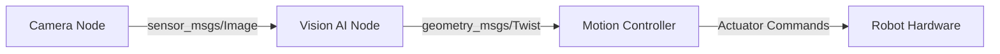

# Research: Module 1 – The Robotic Nervous System (ROS 2)

**Feature**: 001-module1-ros2
**Date**: 2025-12-18
**Phase**: 0 (Outline & Research)

## Purpose

This document captures research findings and technology decisions for implementing Module 1 as educational content within a Docusaurus-based book platform.

## Key Research Questions

### Q1: How should educational content be structured in Docusaurus?

**Decision**: Use standard Markdown (`.md`) files with Docusaurus frontmatter

**Rationale**:
- Docusaurus natively supports `.md` and `.mdx` formats
- `.md` files are simpler for conceptual content without custom React components
- User specifically requested `.md` format in clarification
- Frontmatter enables metadata (title, sidebar position, tags)
- Syntax highlighting for code blocks is built-in

**Alternatives Considered**:
- **MDX (`.mdx`)**: Allows embedding React components, but adds unnecessary complexity for text-heavy educational content
- **Plain HTML**: Not idiomatic for Docusaurus; harder to maintain and version control
- **External documentation tools**: Would require separate platform; Docusaurus is already specified

**Reference**: https://docusaurus.io/docs/markdown-features

---

### Q2: How should the course be organized (site structure)?

**Decision**: Module-based hierarchy with chapter subpages

**Rationale**:
- Aligns with spec's 3-chapter structure (ROS 2 Fundamentals, Python rclpy, URDF)
- Docusaurus sidebar automatically generated from directory structure
- Enables future modules (Module 2, 3, etc.) without restructuring
- Supports independent reading progression (P1 → P2 → P3 user stories)

**Alternatives Considered**:
- **Flat structure**: All chapters at root level → hard to scale across multiple modules
- **Single-page doc**: Entire module in one file → poor UX for 45-75 minute read time
- **Wiki-style**: Cross-linked pages without hierarchy → confusing navigation for linear learning

**Proposed Structure**:
```
docs/
├── intro.md                    # Book introduction
├── module1-ros2-nervous-system/
│   ├── index.md                # Module 1 overview
│   ├── 01-ros2-fundamentals.md # Chapter 1 (P1)
│   ├── 02-python-rclpy.md      # Chapter 2 (P2)
│   └── 03-urdf-humanoids.md    # Chapter 3 (P3)
└── _category_.json             # Sidebar config
```

---

### Q3: What Docusaurus features are needed for educational content?

**Decision**: Admonitions, code blocks, and diagrams (Mermaid)

**Rationale**:
- **Admonitions** (`:::tip`, `:::warning`): Highlight key concepts, prerequisites, and edge cases
- **Code blocks**: Demonstrate rclpy snippets with syntax highlighting (FR-004)
- **Mermaid diagrams**: Visualize ROS 2 data flow (FR-003) without external image dependencies
- All features built into Docusaurus with zero additional plugins

**Alternatives Considered**:
- **Interactive code playgrounds**: Out of scope (spec excludes hands-on exercises)
- **Video embeds**: Not specified; text-first approach aligns with book format
- **Quizzes/assessments**: Success criteria mention quizzes, but implementation is post-content (not part of Module 1 content authoring)

**Reference**: https://docusaurus.io/docs/markdown-features/admonitions

---

### Q4: How should code snippets be presented (rclpy examples)?

**Decision**: Minimal, annotated Python snippets (10-20 lines max)

**Rationale**:
- Spec requirement FR-009: "conceptual focus, minimal code"
- User story P2 acceptance: learners should "read and explain" code, not execute it
- Comments explain ROS-specific concepts (e.g., `# Publisher sends Twist messages to /cmd_vel`)
- No imports, no main blocks, no full working examples (out of scope per FR-009)

**Example Pattern**:
```python
# Create a publisher for robot velocity commands
self.velocity_pub = self.create_publisher(Twist, '/cmd_vel', 10)

# Publish a forward motion command
msg = Twist()
msg.linear.x = 0.5  # Move forward at 0.5 m/s
self.velocity_pub.publish(msg)
```

**Alternatives Considered**:
- **Full working nodes**: Violates "no full implementations" constraint
- **Pseudocode**: Less concrete; learners can't relate to real rclpy syntax
- **C++ examples**: Spec explicitly chooses Python as AI control layer

---

### Q5: How should URDF structure be illustrated?

**Decision**: Simplified XML snippets with explanatory comments

**Rationale**:
- Spec requirement FR-006: "define URDF structure: links, joints, sensors"
- Learners need to *read* URDF, not *write* production-ready robot descriptions
- Focus on conceptual elements (link definitions, joint types, sensor declarations)
- Omit complex visual/collision geometry, inertia matrices (advanced topics per FR-010)

**Example Pattern**:
```xml
<link name="torso">
  <!-- Visual representation of robot torso -->
</link>

<joint name="shoulder_joint" type="revolute">
  <parent link="torso"/>
  <child link="upper_arm"/>
  <axis xyz="0 0 1"/>  <!-- Rotates around Z axis -->
  <limit lower="-1.57" upper="1.57"/>  <!-- +/- 90 degrees -->
</joint>
```

**Alternatives Considered**:
- **Complete humanoid URDF**: Too complex; violates "conceptual focus"
- **Link to external URDF repos**: Learners should see structure inline, not hunt for files
- **Diagram-only approach**: Text alone insufficient; spec requires "URDF structure" explanation

---

### Q6: How should diagrams for ROS 2 data flow be created?

**Decision**: Mermaid diagrams embedded in Markdown

**Rationale**:
- Native Docusaurus support for Mermaid (via `@docusaurus/theme-mermaid`)
- Version-controlled as text (no binary image files)
- Easy to update and maintain
- Adequate for conceptual diagrams (sensor → node → actuator flow)

**Example Pattern**:


**Alternatives Considered**:
- **External diagramming tools** (draw.io, Lucidchart): Requires export/import; harder to maintain
- **ASCII art**: Not professional; poor readability
- **React components**: Overkill for static diagrams

**Reference**: https://docusaurus.io/docs/markdown-features/diagrams

---

## Technology Stack Summary

| Component | Technology | Rationale |
|-----------|-----------|-----------|
| Content Format | Markdown (`.md`) | User-specified; simpler than MDX for text-heavy content |
| Code Highlighting | Docusaurus built-in (Prism) | Automatic Python syntax highlighting |
| Diagrams | Mermaid | Text-based, version-controlled, native support |
| Admonitions | Docusaurus admonitions | Highlight tips, warnings, prerequisites |
| Site Generator | Docusaurus 3.x | Already specified in constitution |
| Deployment | GitHub Pages | Already specified in constitution |

---

## Implementation Approach

### Content Authoring Workflow

1. **Initialize Docusaurus project** (if not already done)
   - Configure `docusaurus.config.js` with site metadata
   - Enable Mermaid plugin for diagrams
   - Set up sidebar structure for Module 1

2. **Create Module 1 directory structure**
   - `docs/module1-ros2-nervous-system/` folder
   - `_category_.json` for sidebar label and position
   - Individual `.md` files for each chapter

3. **Author Chapter 1: ROS 2 Fundamentals** (P1)
   - Explain nodes, topics, services, actions
   - Include Mermaid diagram for pub-sub pattern
   - Minimal code snippets showing topic creation

4. **Author Chapter 2: Python Agents with rclpy** (P2)
   - Demonstrate publisher/subscriber patterns
   - Show service call pattern
   - Bridge AI output to motion commands (conceptual)

5. **Author Chapter 3: URDF for Humanoids** (P3)
   - Define links, joints, sensors
   - Simplified URDF XML snippets
   - Explain simulation vs control roles

### Testing Strategy

Per spec, testing focuses on **learner comprehension**, not code execution:
- **Manual validation**: Review content for accuracy and clarity
- **Peer review**: Have target audience (AI engineers) read and provide feedback
- **Success criteria validation**: Post-launch surveys and quizzes measure SC-001 through SC-006

**No automated tests** for content itself (this is educational material, not software functionality).

---

## Open Questions & Assumptions

### Assumptions
- Docusaurus is already initialized at repository root (or will be in setup phase)
- `@docusaurus/theme-mermaid` plugin is available or will be installed
- Book branding/theme already configured (colors, logo, footer)
- GitHub Pages deployment workflow already exists

### Open Questions (for implementation phase)
- Should Module 1 have an introduction page (`index.md`) or dive straight into Chapter 1?
  - **Recommendation**: Include `index.md` for module overview, prerequisites, and learning objectives
- Should code snippets include line numbers?
  - **Recommendation**: Yes, for reference during discussions (Docusaurus supports this via `showLineNumbers`)
- Should each chapter end with "Further Reading" links?
  - **Recommendation**: Yes, per Risk Mitigation 1 in spec (provide hands-on tutorial links)

---

## Constitution Compliance

### Principles Alignment

- **I. Spec-First Development**: ✅ This plan derived entirely from `spec.md` (user stories, functional requirements, success criteria)
- **II. No Hallucination Tolerance**: ✅ All decisions reference Docusaurus official docs, spec requirements, or explicit user input
- **VII. Reproducibility**: ✅ Content is plain text (`.md`), version-controlled, and reproducible via Docusaurus build

### Deviations
None. Educational content authoring doesn't require:
- Typed interfaces (no APIs or data models)
- TDD (content is manually validated, not unit tested)
- Modular architecture (content is standalone Markdown files)

---

## Next Steps

1. **Proceed to Phase 1**: Create `data-model.md` (N/A for educational content) and `quickstart.md`
2. **Generate plan.md**: Consolidate research findings into implementation plan
3. **Move to `/sp.tasks`**: Break down content authoring into taskable units (one task per chapter)
