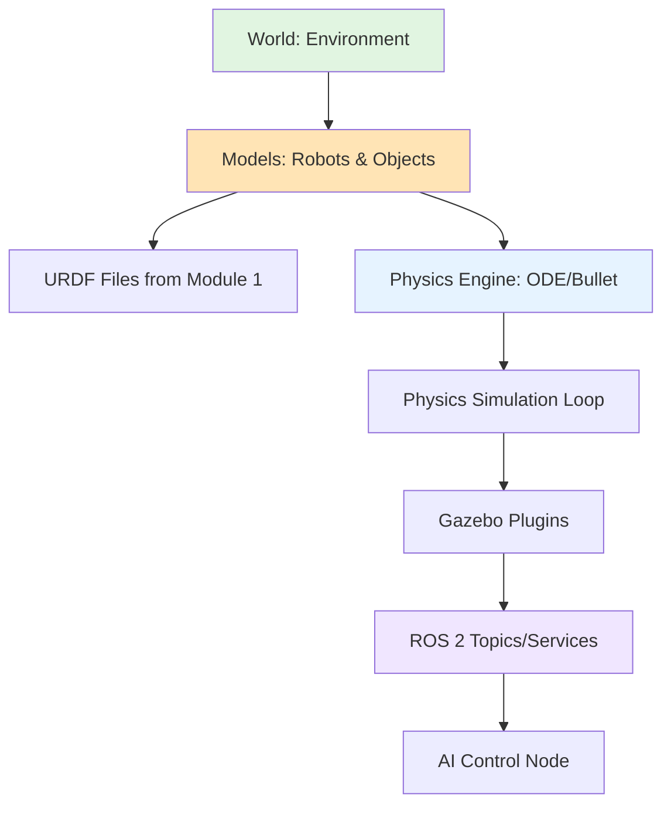
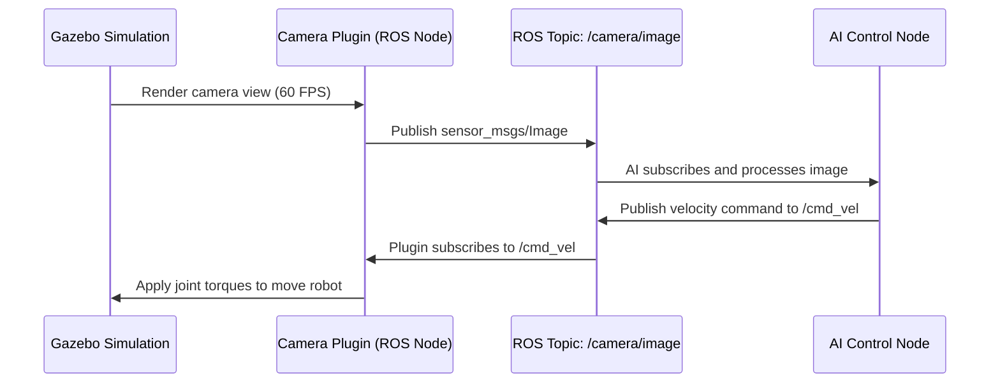

# Chapter 1: Physics Simulation with Gazebo

## Why Digital Twins?

Imagine you're developing AI control software for a humanoid robot. You need to test:
- **Walking on uneven terrain** (what if the robot falls?)
- **Object manipulation** (what if it drops fragile items?)
- **Collision avoidance** (what if it crashes into walls?)

Testing these scenarios on real hardware is:
- **Expensive**: Hardware damage costs thousands of dollars
- **Slow**: Physical setup and reset takes hours
- **Dangerous**: Falling robots can injure people

This is where **digital twins** become essential.

**Digital Twin**: A virtual replica of your physical robot, running in a simulated environment with realistic physics.

### Benefits of Digital Twin Simulation

1. **Cost Savings**
   - Test destructive scenarios without breaking hardware
   - Iterate on control algorithms rapidly (no physical setup)
   - Train AI models with millions of simulated scenarios

2. **Safety**
   - Test dangerous edge cases (high-speed collisions, falls from heights)
   - Validate safety-critical behaviors before real-world deployment
   - Protect humans and expensive equipment

3. **Speed**
   - Run simulations faster than real-time (10x-100x speedup)
   - Parallelize testing across multiple virtual robots
   - Rapid iteration cycles (seconds vs hours)

4. **Scalability**
   - Simulate 100 robots in parallel on one machine
   - Test rare edge cases that are hard to reproduce physically
   - Generate diverse training data for robust AI

:::tip Real-World Example
Tesla trains its self-driving AI using millions of simulated driving scenarios. Similarly, humanoid robot companies (Boston Dynamics, Agility Robotics) test gaits and manipulation tasks in simulation before real-world deployment.
:::

---

## Physics Engines Explained

A **physics engine** is software that simulates real-world physics laws. It computes how objects move, collide, and interact based on forces and constraints.

### Core Physics Concepts

**1. Gravity**
- Acceleration due to Earth's gravity: 9.81 m/s²
- Objects fall, robots must balance against gravity
- Affects walking dynamics (center of mass, momentum)

**2. Collisions**
- Detect when two objects touch
- Compute impact forces and response (bounce, friction, deformation)
- Prevent interpenetration (objects passing through each other)

**3. Friction**
- Surface contact forces that resist motion
- Critical for walking (foot-ground contact)
- Affects object grasping (hand-object contact)

**4. Joint Dynamics**
- Revolute joints (hinges like elbows, knees)
- Prismatic joints (linear like telescoping arms)
- Joint limits, velocities, and torques

### Rigid Body vs Soft Body Physics

**Rigid Body Physics** (most common in robotics):
- Objects are solid and don't deform
- Efficient to compute (real-time simulation)
- Example: Metal robot links, hard plastic objects

**Soft Body Physics** (advanced):
- Objects deform under forces (skin, cloth, rubber)
- Computationally expensive
- Example: Flexible robot skin, deformable objects

**Humanoid robots primarily use rigid body physics** since metal links and joints are stiff.

### Time-Step and Accuracy

Physics engines compute in discrete time-steps:
- **Small time-step** (e.g., 1ms): More accurate but slower
- **Large time-step** (e.g., 10ms): Faster but less accurate

**Trade-off**: Real-time simulation requires balancing accuracy and speed.

:::info Physics Engines in Gazebo
Gazebo supports multiple physics engines:
- **ODE (Open Dynamics Engine)**: Fast, suitable for most robotics
- **Bullet**: Good for rigid body collisions
- **Simbody**: High-fidelity biomechanics

Most users stick with ODE for its balance of speed and accuracy.
:::

---

## Gazebo Architecture

Gazebo is a **physics-first** robot simulator designed for the ROS ecosystem. It provides realistic physics and sensor simulation.

### Core Components

1. **World**
   - The simulated environment (ground, walls, objects, lighting)
   - Defined in SDF (Scene Description Format) files
   - Example: Indoor apartment, outdoor terrain, warehouse

2. **Models**
   - Robots and objects in the world
   - Defined by URDF (from Module 1 Chapter 3) or SDF
   - Example: Humanoid robot, table, chair, ball

3. **Plugins**
   - Software that extends Gazebo functionality
   - Connects Gazebo to ROS 2 (publish sensor data, receive commands)
   - Example: Camera plugin publishes to `/camera/image` topic

4. **SDF (Scene Description Format)**
   - XML format that describes worlds, models, and physics properties
   - More powerful than URDF (supports sensors, plugins, lighting)
   - Example: Specify friction coefficients, mass, inertia

### Gazebo Workflow



**Flow**:
1. Load world (environment) with models (robots, objects)
2. Physics engine simulates forces, collisions, joint dynamics
3. Plugins extract sensor data and publish to ROS 2 topics
4. AI control nodes subscribe to sensor data and publish commands

---

## URDF in Gazebo

In Module 1 Chapter 3, you learned how URDF defines a robot's structure (links, joints, sensors). Now you'll see how URDF is used in Gazebo simulation.

### Loading URDF into Gazebo

Gazebo reads your humanoid robot's URDF file and:
1. **Creates visual models**: Renders the robot in 3D (torso, arms, legs)
2. **Creates collision geometry**: Uses simplified shapes for physics (faster computation)
3. **Applies inertial properties**: Uses mass and inertia tensors for realistic dynamics

**Conceptual Example** (from Module 1 URDF):

```xml
<link name="base_link">
  <visual>
    <geometry>
      <box size="0.3 0.2 0.5"/>  <!-- What you see -->
    </geometry>
  </visual>
  <collision>
    <geometry>
      <box size="0.3 0.2 0.5"/>  <!-- What physics engine uses -->
    </geometry>
  </collision>
  <inertial>
    <mass value="10.0"/>  <!-- 10 kg torso -->
    <inertia ixx="1.0" iyy="1.0" izz="1.0"/>  <!-- Inertia tensor -->
  </inertial>
</link>
```

### Visual vs Collision Geometry

**Visual Geometry**: High-detail mesh for rendering (looks realistic)
**Collision Geometry**: Simplified shapes for physics (computes faster)

**Example**:
- Visual: Detailed hand model with 5 fingers
- Collision: Simple box or sphere (physics doesn't need finger details)

**Why separate?** Collision detection with detailed meshes is slow. Simplified collision geometry allows real-time physics.

### Inertial Properties Matter

Physics accuracy depends on correct mass and inertia:
- **Too light**: Robot floats unrealistically
- **Too heavy**: Robot moves sluggishly
- **Wrong inertia**: Robot spins or falls unexpectedly

**Best Practice**: Measure real robot masses or use CAD software to compute inertia tensors.

:::tip Cross-Reference to Module 1
Revisit Module 1 Chapter 3 (URDF) to see how links and joints are defined. Everything you learned there applies directly in Gazebo simulation!
:::

---

## Gazebo-ROS 2 Integration

Gazebo and ROS 2 communicate via **Gazebo plugins**—software bridges that make simulated sensors behave like real sensors.

### How Plugins Work

1. **Gazebo Plugin**: Code that runs inside Gazebo simulation
2. **ROS 2 Node**: Plugin acts as a ROS 2 node (can publish/subscribe)
3. **Sensor Data**: Plugin extracts simulated sensor data (camera images, LiDAR scans)
4. **Command Topics**: Plugin subscribes to control commands (e.g., `/cmd_vel`)

**Example**: Camera Plugin



### Common Gazebo-ROS 2 Plugins

| Plugin | ROS 2 Topic | Message Type | Purpose |
|--------|-------------|--------------|---------|
| Camera | `/camera/image` | `sensor_msgs/Image` | RGB camera images |
| Depth Camera | `/camera/depth` | `sensor_msgs/Image` | Depth images for 3D perception |
| LiDAR | `/scan` | `sensor_msgs/LaserScan` | 2D laser range data |
| IMU | `/imu` | `sensor_msgs/Imu` | Orientation and acceleration |
| Joint States | `/joint_states` | `sensor_msgs/JointState` | Current joint positions/velocities |
| Differential Drive | `/cmd_vel` | `geometry_msgs/Twist` | Velocity commands for mobile bases |

### Publishing Sensor Data

**Pattern** (from Module 1 Chapter 2):
```python
# AI Control Node subscribes to simulated camera
self.image_sub = self.create_subscription(
    Image,
    '/camera/image',  # Published by Gazebo camera plugin
    self.process_image_callback,
    10
)
```

**Key Insight**: Your AI code doesn't know if the sensor is real or simulated! The ROS 2 topic abstraction makes switching between simulation and reality seamless.

### Subscribing to Commands

**Pattern**:
```python
# AI Control Node publishes velocity commands
self.cmd_pub = self.create_publisher(Twist, '/cmd_vel', 10)

cmd = Twist()
cmd.linear.x = 0.5  # Move forward at 0.5 m/s
self.cmd_pub.publish(cmd)
```

Gazebo plugin subscribes to `/cmd_vel` and applies forces to robot joints to achieve the commanded velocity.

:::tip Seamless Sim-to-Real
The same Python rclpy code (from Module 1 Chapter 2) works in both simulation and on real hardware. Just change the data source from Gazebo topics to real sensor topics!
:::

---

## Sim-to-Real Gap

**Sim-to-Real Gap**: Differences between simulated and real-world robot behavior.

Even with perfect physics simulation, reality differs from simulation. Understanding this gap is critical for deploying AI trained in simulation.

### Sources of Sim-to-Real Gap

**1. Physics Model Limitations**
- **Friction**: Real-world friction is complex (varies with temperature, surface wear)
- **Contact Dynamics**: Simulation approximates soft contacts (real feet deform)
- **Air Resistance**: Often ignored in simulation

**2. Sensor Realism**
- **Noise**: Real sensors have noise (Gaussian, salt-and-pepper, motion blur)
- **Calibration**: Real camera intrinsics differ from simulated ones
- **Lighting**: Simulation lighting rarely matches real-world conditions

**3. Actuator Dynamics**
- **Motor Response**: Real motors have delays, backlash, and non-linear torque curves
- **Power Limits**: Real motors overheat and lose torque
- **Mechanical Wear**: Joints become loose over time

### Mitigating Sim-to-Real Gap

**1. Domain Randomization** (Chapter 3 will cover this in detail)
- Vary physics parameters (mass, friction, joint damping)
- Randomize sensor noise levels
- Changes lighting and textures

**2. System Identification**
- Measure real robot properties (mass, inertia, friction)
- Update simulation parameters to match reality
- Use real sensor calibration data

**3. Sim-to-Real Transfer Techniques**
- Train AI with diverse simulated scenarios
- Fine-tune AI with small amounts of real-world data
- Use sim-to-real adaptation algorithms (reality gap compensation)

:::warning Don't Expect Perfect Transfer
AI trained purely in simulation **will** behave differently on real hardware. Budget time for real-world fine-tuning and testing.
:::

---

## When to Use Gazebo

Gazebo is ideal for scenarios where **physics accuracy** matters more than visual realism.

### Best Use Cases

✅ **Testing Control Algorithms**
- Balance control for bipedal walking
- Inverse kinematics validation
- Motion planning collision avoidance

✅ **Multi-Robot Systems**
- Simulate 10-100 robots interacting
- Test swarm behaviors
- Validate communication protocols

✅ **Long-Duration Experiments**
- Run 24-hour stress tests (faster than real-time)
- Collect rare failure modes
- Test battery depletion scenarios

✅ **Safety-Critical Scenarios**
- High-speed collisions
- Falls from heights
- Emergency stop behaviors

### When Gazebo is NOT Ideal

❌ **Vision-Based AI Requiring Photorealism**
- Object detection with complex textures (use Unity instead)
- Scene understanding in realistic indoor environments
- Marketing videos or demos (Gazebo graphics are functional, not beautiful)

❌ **Human-Robot Interaction**
- Realistic human avatars and social behaviors (Unity excels here)
- Fine-grained hand manipulation with visual feedback

**Solution**: Use Unity for vision AI, Gazebo for control/physics (Chapter 2 will explain when to choose each).

---

## Key Takeaways

✅ **Digital twins** enable safe, cost-effective testing of AI control logic before real-world deployment

✅ **Physics engines** simulate gravity, collisions, friction, and joint dynamics for realistic robot behavior

✅ **Gazebo** is a physics-first simulator designed for the ROS 2 ecosystem

✅ **URDF** (from Module 1) defines robot structure and is loaded directly into Gazebo

✅ **Gazebo plugins** act as ROS 2 nodes, publishing sensor data and subscribing to commands

✅ **Sim-to-real gap** exists due to physics model limitations, sensor differences, and actuator dynamics

✅ **Domain randomization** and system identification help mitigate sim-to-real transfer challenges

---

## Prerequisites for Chapter 2

Before moving to Chapter 2, ensure you can:

- ✅ Explain why digital twins are critical for humanoid robotics (cost, safety, speed)
- ✅ Describe the role of physics engines in simulation
- ✅ Understand how URDF is loaded into Gazebo
- ✅ Explain how Gazebo plugins publish sensor data to ROS 2 topics
- ✅ Identify sources of the sim-to-real gap

:::info Ready for Unity?
In [Chapter 2: Environment Building with Unity](./02-environment-building-unity.md), you'll learn when high-fidelity graphics matter more than physics accuracy—and how Unity complements Gazebo for vision-based AI.
:::

---

## Further Reading

- [Gazebo Official Documentation](https://gazebosim.org/docs)
- [ROS 2 Gazebo Integration Tutorial](https://docs.ros.org/en/humble/Tutorials/Advanced/Simulators/Gazebo/Gazebo.html)
- [SDF (Scene Description Format) Specification](http://sdformat.org/)
- [Sim-to-Real Transfer in Robotics (Survey Paper)](https://arxiv.org/abs/1812.03823)
- [Gazebo-ROS 2 Plugin Examples](https://github.com/gazebosim/gz-ros2-control)
