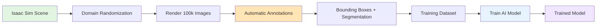
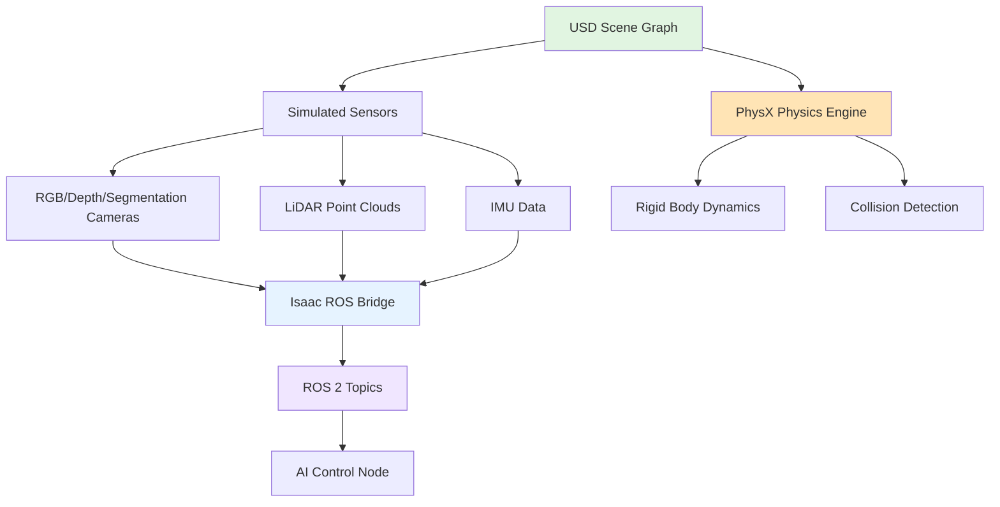

# Chapter 1: Isaac Sim - Photorealistic Simulation

## What is Isaac Sim?

**Isaac Sim** is NVIDIA's GPU-accelerated robotics simulation platform designed for training and testing AI-powered robots. It combines the best of both worlds: **accurate physics** and **photorealistic graphics**.

### Core Components

1. **Omniverse Platform**
   - Built on NVIDIA Omniverse (collaborative 3D design platform)
   - Uses USD (Universal Scene Description) for scene representation
   - Real-time collaboration and asset sharing

2. **PhysX Physics Engine**
   - GPU-accelerated rigid body dynamics
   - Accurate collision detection and response
   - Joint constraints and articulation (humanoid robots)

3. **RTX Ray Tracing**
   - Photorealistic lighting, shadows, and reflections
   - Path-traced rendering for realistic sensor simulation
   - Material properties (PBR - Physically Based Rendering)

4. **ROS 2 Integration**
   - Isaac ROS Bridge (publishes sensor data to ROS 2 topics)
   - Native ROS 2 message support (sensor_msgs, nav_msgs)
   - Seamless integration with ROS 2 workflows

**Key Insight**: Isaac Sim is not just a simulator—it's a **platform for generating synthetic training data** at scale for vision-based AI.

---

## Isaac Sim vs Gazebo vs Unity

You've learned about Gazebo (Module 2 Chapter 1) and Unity (Module 2 Chapter 2). How does Isaac Sim compare?

| Aspect | Gazebo | Unity | Isaac Sim |
|--------|--------|-------|-----------|
| **Physics Accuracy** | Good (ODE/Bullet) | Fair (PhysX/Havok) | Excellent (GPU PhysX) |
| **Graphics Quality** | Basic | Excellent (game engine) | Photorealistic (RTX ray tracing) |
| **GPU Acceleration** | No (CPU-based) | Partial (rendering only) | Yes (physics + rendering) |
| **ROS 2 Integration** | Native (plugins) | Via Unity Robotics Hub | Native (Isaac ROS Bridge) |
| **Synthetic Data Generation** | Limited | Good | Excellent (domain randomization, annotations) |
| **Use Cases** | Control testing, physics validation | Vision AI, HRI, marketing | Large-scale vision AI training |
| **Learning Curve** | Low (ROS ecosystem) | Medium (game engine) | Medium-High (NVIDIA ecosystem) |
| **Hardware Requirements** | Any CPU | Any GPU | NVIDIA GPU (RTX series recommended) |
| **Cost** | Free (open source) | Free (Personal), Paid (Pro) | Free (with NVIDIA account) |

### When to Use Each Tool

**Use Gazebo when**:
- ✅ Testing control algorithms (PID, MPC, trajectory planning)
- ✅ CPU-based workflows (no GPU available)
- ✅ Rapid prototyping with ROS 2 ecosystem

**Use Unity when**:
- ✅ Human-robot interaction scenarios (realistic environments)
- ✅ Marketing videos and demos (game engine quality)
- ✅ Cross-platform deployment (AR/VR, mobile)

**Use Isaac Sim when**:
- ✅ Training vision-based AI at scale (100k+ synthetic images)
- ✅ GPU-accelerated physics + photorealistic rendering
- ✅ NVIDIA hardware ecosystem (Jetson, datacenter GPUs)
- ✅ Domain randomization for robust AI models

:::tip Real-World Example
Tesla trains its Autopilot AI using millions of simulated driving scenarios. Similarly, humanoid robot companies (Figure AI, 1X Technologies) use Isaac Sim to generate diverse training data for manipulation and navigation tasks.
:::

---

## Photorealistic Sensor Simulation

Isaac Sim's **RTX ray tracing** enables realistic sensor simulation that closely matches real-world sensor behavior.

### RTX Ray Tracing for Sensors

**Ray tracing** simulates how light bounces in the real world:
- Light rays travel from the camera, bounce off surfaces, and return
- Accurate shadows, reflections, and refractions
- Realistic material properties (metal reflects, glass refracts)

**Why this matters for robotics**:
- Simulated camera images look like real camera images
- AI trained on synthetic data transfers better to real robots
- Edge cases can be tested safely (low light, glare, occlusion)

### Simulated Sensor Types

**1. RGB Cameras**
- Photorealistic color images with accurate lighting
- Lens distortion, motion blur, depth of field
- Use case: Object detection, scene understanding

**2. Depth Cameras**
- Accurate depth measurements (Z-distance to each pixel)
- Simulates stereo cameras, structured light, time-of-flight (ToF)
- Use case: 3D perception, obstacle avoidance, grasping

**3. Segmentation Cameras**
- Pixel-perfect semantic labels (person, chair, table, wall)
- Instance segmentation (separate each object)
- Use case: Training segmentation models, scene understanding

**4. LiDAR (Light Detection and Ranging)**
- Ray-traced laser beams for accurate 3D point clouds
- Simulates occlusion, reflectance, and noise
- Use case: SLAM (Simultaneous Localization and Mapping), navigation

**5. IMU (Inertial Measurement Unit)**
- Accelerometer and gyroscope data
- Simulates sensor noise and drift
- Use case: Balance control, odometry

### Physically Based Rendering (PBR)

Isaac Sim uses **PBR materials** for realistic surfaces:
- **Albedo**: Base color (what color is the object?)
- **Roughness**: How rough or smooth is the surface?
- **Metallic**: Is it metal or non-metal?
- **Normal Maps**: Surface details (bumps, scratches)

**Example**: A metal robot arm looks shiny and reflects light, while a wooden table looks rough and absorbs light.

---

## Synthetic Data Generation

**Synthetic data** = AI training data generated in simulation (not collected from real world).

### Why Synthetic Data?

**1. Cost Savings**
- Real-world data collection is expensive (cameras, annotators, time)
- Synthetic data generation costs only GPU compute time
- Example: 100k labeled images cost $100k with human annotators vs $1k in GPU time

**2. Scale**
- Generate millions of diverse scenarios impossible to collect in real world
- Vary lighting, textures, object placements, camera angles
- Example: Train on 1 million images in 1 week vs 1 year of real-world collection

**3. Edge Cases**
- Test dangerous scenarios safely (robot falling, collisions, fire)
- Generate rare events (person in wheelchair, broken glass on floor)
- Example: Train on 10k collision scenarios without damaging real robots

**4. Perfect Annotations**
- Pixel-perfect ground truth (no human labeling errors)
- Automatic bounding boxes, segmentation masks, keypoints
- Example: 100k images with perfect labels in 1 day vs 6 months with annotators

### Domain Randomization

**Domain randomization** varies simulation parameters to create diverse training data:

**Lighting Randomization**:
- Vary light intensity, color temperature, direction
- Simulate sunlight, indoor lighting, shadows
- Example: Train on 1000 lighting conditions → robust to any lighting

**Texture Randomization**:
- Swap textures on walls, floors, objects
- Use procedural textures (noise, patterns)
- Example: Train on 500 textures → generalize to unseen environments

**Object Randomization**:
- Place objects in random positions and orientations
- Vary object shapes, sizes, colors
- Example: Train on 1000 object arrangements → detect objects anywhere

**Camera Randomization**:
- Vary camera position, angle, focal length
- Simulate camera noise, motion blur, exposure
- Example: Train on 100 camera positions → robust viewpoint invariance

### Synthetic Data Pipeline Example



**Real-World Example**:
- **Input**: 1 Isaac Sim scene (indoor apartment)
- **Process**: Domain randomization (lighting, textures, objects)
- **Output**: 100,000 labeled images for training object detection AI
- **Result**: AI model generalizes to real-world apartments

---

## Isaac Sim Architecture

Isaac Sim's architecture connects simulation to ROS 2 workflows:



### USD Scene Graph

**Universal Scene Description (USD)** is a hierarchical scene representation:
- **Prims**: Scene objects (robot, table, camera)
- **Attributes**: Properties (position, rotation, color)
- **Relationships**: Connections (camera attached to robot)
- **Layers**: Composition (combine multiple scene files)

**Example Hierarchy**:
```
/World
  /Robot
    /Body
    /LeftArm
    /RightArm
    /Camera
  /Table
  /Chair
```

**Key Benefit**: USD scenes are portable—you can share and collaborate on robot environments.

---

## Isaac Sim-ROS 2 Integration

Isaac Sim publishes sensor data to ROS 2 topics just like real sensors.

### Isaac ROS Bridge

**Isaac ROS Bridge** acts as a ROS 2 node inside Isaac Sim:
- Publishes sensor data (images, point clouds, IMU)
- Subscribes to control commands (velocity, joint positions)
- Uses standard ROS 2 message types (sensor_msgs, nav_msgs, geometry_msgs)

**Data Flow**:
1. Isaac Sim renders sensor data (RGB image from camera)
2. Isaac ROS Bridge publishes to `/camera/image` topic (sensor_msgs/Image)
3. AI Control Node subscribes to `/camera/image` and processes image
4. AI Control Node publishes velocity command to `/cmd_vel` (geometry_msgs/Twist)
5. Isaac ROS Bridge applies velocity to robot in simulation

**Conceptual rclpy Pattern** (from Module 1 Chapter 2):
```python
# AI Control Node subscribes to simulated camera
self.image_sub = self.create_subscription(
    Image,
    '/camera/image',  # Published by Isaac Sim
    self.process_image_callback,
    10
)

def process_image_callback(self, msg):
    # Process image for object detection
    # Cross-reference Module 1: ROS 2 topic communication
    pass
```

:::tip Seamless Sim-to-Real
The same Python rclpy code (from Module 1 Chapter 2) works in both Isaac Sim and on real hardware. Just change the data source from Isaac Sim topics to real sensor topics!
:::

---

## When to Use Isaac Sim

Isaac Sim is ideal when GPU resources are available and vision-based AI is the priority.

### Best Use Cases

✅ **Training Vision-Based AI**
- Object detection for manipulation (grasp this mug)
- Scene understanding for navigation (identify doors, stairs)
- Person detection for human-robot interaction

✅ **Large-Scale Data Generation**
- Generate 100k+ labeled images with domain randomization
- Test edge cases (low light, occlusion, clutter)
- Reduce real-world data collection costs

✅ **GPU-Accelerated Workflows**
- PhysX physics runs on GPU (10x-100x faster than CPU)
- Render 1000 images/hour on NVIDIA RTX GPU
- Train AI models on synthetic data in days, not months

✅ **NVIDIA Hardware Ecosystem**
- Seamless integration with NVIDIA Jetson (edge devices)
- Deploy trained models on Jetson with Isaac ROS (Chapter 2)
- Unified workflow from simulation to deployment

### When Isaac Sim is NOT Ideal

❌ **CPU-Only Workflows**
- Isaac Sim requires NVIDIA GPU (no CPU fallback)
- Use Gazebo if GPU is unavailable

❌ **Simple Physics Testing**
- Overkill for basic control algorithm testing
- Use Gazebo for simpler physics validation

❌ **Non-NVIDIA Hardware**
- Isaac Sim is optimized for NVIDIA GPUs
- Use Unity if deploying on non-NVIDIA platforms

❌ **Rapid Prototyping Without AI Training**
- Setup overhead for Isaac Sim is higher than Gazebo
- Use Gazebo for quick control experiments

---

## Key Takeaways

✅ **Isaac Sim** combines GPU-accelerated physics (PhysX) and photorealistic rendering (RTX) for vision-based AI training

✅ **Comparison**: Gazebo (CPU physics, basic graphics), Unity (game engine graphics, fair physics), Isaac Sim (GPU physics + RTX graphics)

✅ **Synthetic data generation** reduces costs and scales training data to millions of labeled images

✅ **Domain randomization** (lighting, textures, objects, camera) improves AI robustness and sim-to-real transfer

✅ **Isaac ROS Bridge** publishes sensor data to ROS 2 topics, enabling seamless simulation-to-reality workflows

✅ **Use Isaac Sim when**: Training vision-based AI, generating large-scale synthetic data, leveraging NVIDIA hardware

✅ **USD scene graphs** enable collaborative and portable robot environments

---

## Prerequisites for Chapter 2

Before moving to Chapter 2, ensure you can:

- ✅ Explain what Isaac Sim is and how it differs from Gazebo/Unity
- ✅ Describe why synthetic data generation matters for training vision-based AI
- ✅ Understand domain randomization techniques (lighting, textures, objects, camera)
- ✅ Know when to use Isaac Sim vs Gazebo vs Unity (tool selection)
- ✅ Recognize the Isaac ROS Bridge role in ROS 2 integration

:::info Ready for Isaac ROS?
In [Chapter 2: Isaac ROS - GPU-Accelerated Perception](./02-isaac-ros.md), you'll learn how GPU-accelerated ROS 2 nodes enable real-time Visual SLAM, object detection, and depth processing on NVIDIA hardware.
:::

---

## Further Reading

- [Isaac Sim Documentation](https://docs.omniverse.nvidia.com/isaacsim/latest/) - Official NVIDIA Isaac Sim docs
- [NVIDIA Omniverse](https://www.nvidia.com/en-us/omniverse/) - Platform overview
- [Synthetic Data Generation for Robotics](https://developer.nvidia.com/blog/synthetic-data-generation-for-robotics/) - NVIDIA blog post
- [Domain Randomization for Sim-to-Real Transfer](https://arxiv.org/abs/1703.06907) - Research paper
- [USD Scene Description](https://openusd.org/) - Universal Scene Description specification
