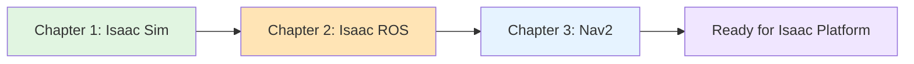

# Module 3: The AI-Robot Brain (NVIDIA Isaac)

## What You'll Learn

Welcome to Module 3! This module teaches AI engineers how **NVIDIA Isaac platform** serves as the "AI-robot brain"—providing GPU-accelerated simulation, perception, and navigation for humanoid robots.

The Isaac ecosystem combines photorealistic simulation (Isaac Sim), hardware-accelerated perception (Isaac ROS), and autonomous navigation (Nav2) to enable intelligent robot behavior.

**By the end of this module, you will**:
- ✅ Understand Isaac Sim's role and when to use it vs Gazebo/Unity
- ✅ Explain GPU-accelerated perception with Isaac ROS and when it matters
- ✅ Describe Nav2 navigation architecture and humanoid-specific challenges
- ✅ Compare CPU-based vs GPU-accelerated workflows for robotics AI

## Prerequisites

Before starting this module, you should have:

- **Module 1 Completion**: Understanding of ROS 2 fundamentals, Python rclpy, and URDF (from Module 1)
- **Module 2 Completion**: Understanding of digital twins, Gazebo, Unity, and sensor simulation (from Module 2)
- **AI/ML Background**: Familiarity with training data generation and model testing
- **Curiosity About GPU Acceleration**: Interest in how NVIDIA hardware accelerates robotics AI

:::tip No NVIDIA GPU Required
This module is **conceptual**—you don't need NVIDIA hardware to learn these concepts. Hands-on Isaac tutorials can come later.
:::

## Learning Objectives

### 1. Isaac Sim for Photorealistic Simulation

You'll learn when and why to use NVIDIA's simulation platform:
- What is Isaac Sim and how it differs from Gazebo/Unity
- GPU-accelerated physics (PhysX) and photorealistic rendering (RTX ray tracing)
- Synthetic data generation for training vision-based AI
- Isaac Sim-ROS 2 integration patterns

### 2. Isaac ROS for GPU-Accelerated Perception

You'll understand when GPU acceleration benefits perception:
- What is Isaac ROS (GPU-accelerated ROS 2 nodes)
- Visual SLAM (VSLAM) for real-time localization and mapping
- Key perception packages: depth processing, object detection, image preprocessing
- CPU vs GPU trade-offs: latency, throughput, power consumption

### 3. Nav2 for Autonomous Navigation

You'll master navigation fundamentals and humanoid adaptations:
- Nav2 architecture (perception → mapping → planning → control)
- Key concepts: costmaps, global/local planners, recovery behaviors, behavior trees
- Bipedal navigation challenges: balance constraints, footstep planning, gait coordination
- Integrating Isaac ROS perception with Nav2

### 4. Tool Selection for Robotics AI

You'll gain decision-making skills for choosing the right tools:
- When to use Isaac Sim vs Gazebo vs Unity (simulation)
- When to use Isaac ROS vs CPU-based ROS 2 nodes (perception)
- When to use Nav2 with humanoid adaptations (navigation)

## Chapters

This module consists of three chapters designed to build your understanding progressively:

### Chapter 1: Isaac Sim - Photorealistic Simulation 🎯 **Start Here**

**What**: NVIDIA's GPU-accelerated simulation platform for robotics AI
**Why**: Generate large-scale synthetic training data with photorealistic sensors
**Time**: 15-25 minutes

### Chapter 2: Isaac ROS - GPU-Accelerated Perception

**What**: Hardware-accelerated ROS 2 nodes for real-time perception
**Why**: Run Visual SLAM, object detection, and depth processing at high frame rates
**Time**: 15-25 minutes

### Chapter 3: Nav2 and Humanoid Navigation

**What**: ROS 2 navigation stack with humanoid-specific adaptations
**Why**: Enable autonomous navigation for bipedal robots in indoor environments
**Time**: 15-25 minutes

## Estimated Time

**Total Module**: 45-75 minutes (reading and comprehension)

This is a **conceptual module**—you will not install Isaac Sim, Isaac ROS, or Nav2. The goal is to build mental models that prepare you for hands-on work.

## Learning Path

**Recommended Progression**:
1. Read Chapter 1 to understand **photorealistic simulation** (Isaac Sim)
2. Read Chapter 2 to understand **GPU-accelerated perception** (Isaac ROS)
3. Read Chapter 3 to understand **autonomous navigation** (Nav2)

## What This Module Is NOT

:::warning Scope Boundaries
This module does **NOT** cover:
- ❌ GPU driver installation or CUDA setup
- ❌ Isaac Sim download or installation instructions
- ❌ Isaac ROS package installation procedures
- ❌ Nav2 configuration or deployment
- ❌ Hardware setup (NVIDIA Jetson, desktop GPUs)
- ❌ Benchmark performance testing
- ❌ Custom Isaac ROS node development
- ❌ Advanced Nav2 plugin development

**Why?** This module focuses on **conceptual understanding** to build mental models. Installation and hands-on tutorials belong in official tool documentation.
:::

## After This Module

Once you complete Module 3, you'll be ready to:

1. **Choose the Right Simulation Platform**: Know when to use Isaac Sim, Gazebo, or Unity
2. **Understand GPU Acceleration Benefits**: Know when GPU-accelerated perception is worth the cost
3. **Try Hands-On Isaac Tutorials**: Official Isaac Sim and Isaac ROS tutorials will make sense
4. **Design Navigation Systems**: Structure Nav2 navigation pipelines with humanoid adaptations
5. **Evaluate Hardware Requirements**: Understand what NVIDIA hardware enables (Jetson, desktop GPUs)

:::tip Learn by Doing
After reading this module, we **strongly recommend** following official hands-on tutorials:
- [Isaac Sim Tutorials](https://docs.omniverse.nvidia.com/isaacsim/latest/)
- [Isaac ROS Documentation](https://nvidia-isaac-ros.github.io/)
- [Nav2 Tutorials](https://navigation.ros.org/tutorials/index.html)
:::

## Success Criteria

You'll know you've mastered this module when you can:

- ✅ Compare Isaac Sim, Gazebo, and Unity and choose the right tool for 3 different scenarios
- ✅ List 3 Isaac ROS perception capabilities and explain when GPU acceleration benefits perception
- ✅ Diagram the Nav2 navigation pipeline (perception → costmap → planner → controller)
- ✅ Identify 2 humanoid-specific navigation challenges (balance, footstep planning, terrain adaptation)
- ✅ Explain why synthetic data generation matters for training vision-based AI
- ✅ Describe the difference between CPU-based and GPU-accelerated perception

## Let's Begin!

Ready to learn how NVIDIA Isaac platform serves as the AI-robot brain for humanoid robotics? **Start with [Chapter 1: Isaac Sim - Photorealistic Simulation](./01-isaac-sim.md)**.

:::info Need Help?
If you have questions or find concepts unclear, please open a discussion on our [GitHub Discussions](https://github.com/your-org/physical-ai-book/discussions) page.
:::
