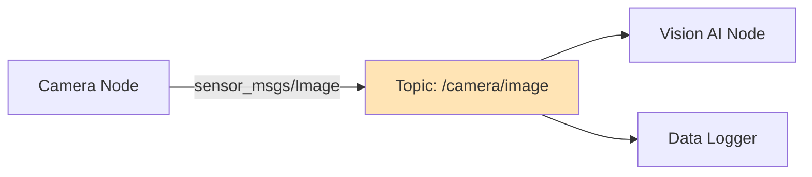
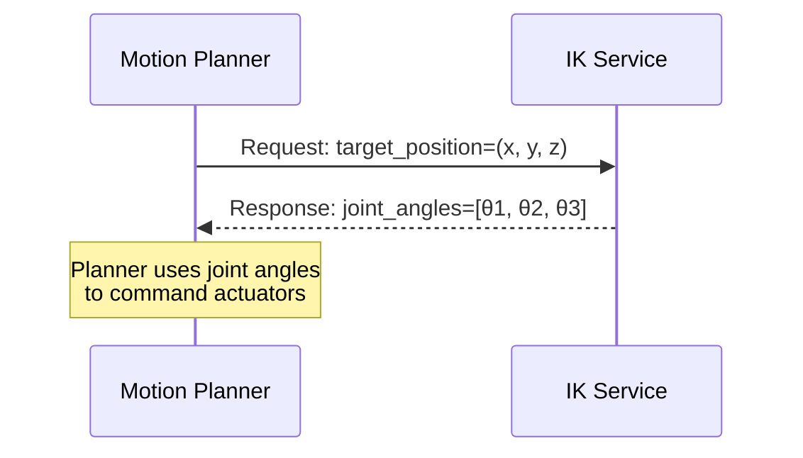
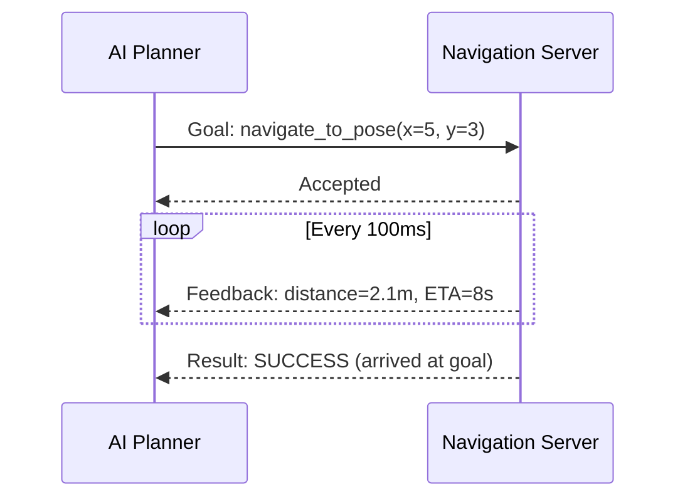
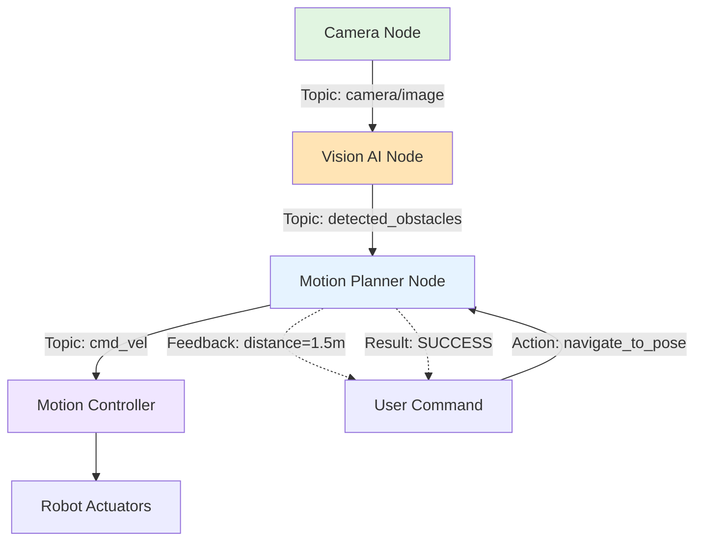

# Chapter 1: ROS 2 Fundamentals

## Why ROS 2 Exists

Imagine building a humanoid robot where:
- A camera captures the environment
- An AI vision model detects objects
- A motion planning algorithm decides how to move
- Motor controllers command the robot's joints

**The Challenge**: How do these independent software components communicate reliably, efficiently, and in a maintainable way?

This is where **ROS 2** (Robot Operating System 2) comes in. ROS 2 is not an operating system in the traditional sense—it's a **middleware framework** that provides:

1. **Modular Communication**: Components (nodes) can be developed, tested, and deployed independently
2. **Language Flexibility**: Nodes can be written in Python, C++, or other languages and still communicate
3. **Scalability**: Add new sensors or actuators without rewriting existing code
4. **Standardization**: Common message types (images, velocities, poses) used across the robotics community

:::tip The Nervous System Analogy
Think of ROS 2 as the **nervous system** of a robot:
- Your **brain** (AI logic) sends signals through nerves
- Signals travel to **muscles** (actuators) to create movement
- **Sensors** (eyes, touch) send feedback back to the brain

ROS 2 provides the "nerves" (communication channels) that connect the robot's brain (AI software) to its body (hardware).
:::

---

## Core Concepts

ROS 2 has four fundamental communication patterns. Understanding these is essential for all robotics work.

### 1. Nodes

**Definition**: A **node** is an independent computational process that performs a specific task.

**Purpose**: Modularity and separation of concerns. Each node has a single, well-defined responsibility.

**Examples**:
- `camera_node`: Captures images from a camera and publishes them
- `vision_ai_node`: Subscribes to images, runs object detection, publishes detected objects
- `motion_controller`: Subscribes to motion commands, controls robot actuators

**Key Insight**: Nodes are the "building blocks" of a ROS 2 system. A complex robot might have 10-50 nodes running simultaneously, each handling one piece of the overall behavior.

```text
Example: Humanoid Robot System
┌─────────────────┐
│  camera_node    │ → Publishes images
└─────────────────┘
┌─────────────────┐
│ vision_ai_node  │ → Processes images, detects objects
└─────────────────┘
┌─────────────────┐
│motion_controller│ → Commands robot joints
└─────────────────┘
```

---

### 2. Topics

**Definition**: A **topic** is a named communication bus for asynchronous, many-to-many message passing.

**Purpose**: Continuous data streams like sensor readings, robot states, or command streams.

**Key Characteristics**:
- **Asynchronous**: Publishers send messages without waiting for subscribers
- **Many-to-Many**: Multiple publishers and subscribers can connect to the same topic
- **Typed**: Each topic has a specific message type (e.g., `sensor_msgs/Image`, `geometry_msgs/Twist`)

**Examples**:
- `/camera/image`: Streams camera images (type: `sensor_msgs/Image`)
- `/cmd_vel`: Robot velocity commands (type: `geometry_msgs/Twist`)
- `/joint_states`: Current positions of all robot joints (type: `sensor_msgs/JointState`)

**How It Works**:
1. **Publisher**: A node creates a publisher for a topic (e.g., `/camera/image`)
2. **Subscriber**: Another node creates a subscriber to the same topic
3. **Messages Flow**: When the publisher sends a message, all subscribers receive it automatically

**Data Flow Example**:



:::info Publisher-Subscriber Pattern
This is a classic **pub-sub** pattern. Publishers don't know who (if anyone) is listening, and subscribers don't know who is sending messages. This loose coupling makes systems flexible and maintainable.
:::

---

### 3. Services

**Definition**: A **service** is a synchronous request-response communication pattern.

**Purpose**: Discrete operations that require a response, like calculations, queries, or state changes.

**Key Characteristics**:
- **Synchronous**: Client waits for the server to respond
- **One-to-One**: One client calls one service at a time
- **Typed**: Each service has a request type and a response type

**Examples**:
- `/compute_ik`: Compute inverse kinematics (Request: target position → Response: joint angles)
- `/reset_pose`: Reset robot to default pose (Request: none → Response: success/failure)
- `/get_robot_state`: Query current robot state (Request: none → Response: full state info)

**When to Use Services vs Topics**:

| Use Case | Use Topics | Use Services |
|----------|------------|--------------|
| Continuous sensor data | ✅ | ❌ |
| Real-time motion commands | ✅ | ❌ |
| Compute a result once | ❌ | ✅ |
| Query system state | ❌ | ✅ |
| Reset or initialize | ❌ | ✅ |

**Example Flow**:



---

### 4. Actions

**Definition**: An **action** is a long-running task with feedback and preemption support.

**Purpose**: Operations that take time to complete (seconds to minutes) and need progress updates.

**Key Characteristics**:
- **Long-Running**: Tasks like navigation, grasping, or complex motions
- **Feedback**: Server sends progress updates while executing
- **Preemptable**: Client can cancel the action midway if needed

**Examples**:
- `/navigate_to_pose`: Navigate robot to a target location (Feedback: distance remaining)
- `/grasp_object`: Grasp an object (Feedback: gripper closure progress)
- `/follow_trajectory`: Follow a planned joint trajectory (Feedback: % complete)

**Three Components**:
1. **Goal**: The desired outcome (e.g., target coordinates)
2. **Feedback**: Progress updates during execution (e.g., "80% complete")
3. **Result**: Final outcome (e.g., "success" or "failed: obstacle detected")

**Example: Navigation Action**:



:::tip When to Use Actions
Use **actions** when:
- The operation takes more than a few seconds
- You need progress feedback (e.g., for a progress bar or status display)
- You might need to cancel the operation before it completes

Use **services** for quick, one-shot operations (< 1 second).
:::

---

## When to Use Each Communication Pattern

| Pattern | Use When | Example |
|---------|----------|---------|
| **Topic** | Continuous data streams, many publishers/subscribers | Camera images, velocity commands, sensor readings |
| **Service** | One-time calculations or queries, need a response | Inverse kinematics, "what is my battery level?" |
| **Action** | Long-running tasks, need feedback and cancellation | Navigation, grasping, trajectory following |

---

## Data Flow Example: Vision-Based Navigation

Let's tie it all together with a realistic scenario: a humanoid robot navigating to a target while avoiding obstacles.



**Flow Breakdown**:
1. **Camera Node** publishes images to `/camera/image` (topic)
2. **Vision AI Node** subscribes to `/camera/image`, detects obstacles, publishes to `/detected_obstacles` (topic)
3. **Motion Planner Node** subscribes to `/detected_obstacles` and plans safe paths
4. **User** sends a goal to Motion Planner via `navigate_to_pose` (action)
5. **Motion Planner** sends velocity commands to `/cmd_vel` (topic)
6. **Motion Controller** subscribes to `/cmd_vel` and commands actuators
7. **Motion Planner** sends feedback and result back to user (action)

:::tip Real-World Insight
In a real humanoid robot system, you'd have 20-50 topics for different sensors (cameras, IMUs, joint encoders), dozens of services for calculations (IK, collision checking), and several actions for high-level behaviors (walk, grasp, turn head).
:::

---

## Key Takeaways

✅ **ROS 2 is a communication framework** that decouples AI software from robot hardware
✅ **Nodes** are independent processes, each with a single responsibility
✅ **Topics** are for continuous, asynchronous data streams (pub-sub pattern)
✅ **Services** are for one-time, synchronous request-response operations
✅ **Actions** are for long-running tasks that need feedback and cancellation
✅ **Choosing the right pattern** (topic vs service vs action) is critical for system design

---

## Prerequisites for Chapter 2

Before moving to Chapter 2, ensure you can:

- ✅ Identify nodes, topics, services, and actions in a system diagram
- ✅ Explain when to use topics vs services vs actions
- ✅ Describe how publisher-subscriber communication works

:::info Ready for Python?
In [Chapter 2: Python Agents with rclpy](./02-python-rclpy.md), you'll see how to implement these concepts in Python code. You'll learn how to create AI control nodes that publish commands and subscribe to sensor data.
:::

---

## Further Reading

- [Official ROS 2 Documentation](https://docs.ros.org/en/humble/)
- [Understanding ROS 2 Nodes](https://docs.ros.org/en/humble/Tutorials/Beginner-CLI-Tools/Understanding-ROS2-Nodes/Understanding-ROS2-Nodes.html)
- [Understanding ROS 2 Topics](https://docs.ros.org/en/humble/Tutorials/Beginner-CLI-Tools/Understanding-ROS2-Topics/Understanding-ROS2-Topics.html)
- [ROS 2 Services Tutorial](https://docs.ros.org/en/humble/Tutorials/Beginner-CLI-Tools/Understanding-ROS2-Services/Understanding-ROS2-Services.html)
- [ROS 2 Actions Tutorial](https://docs.ros.org/en/humble/Tutorials/Beginner-CLI-Tools/Understanding-ROS2-Actions/Understanding-ROS2-Actions.html)
