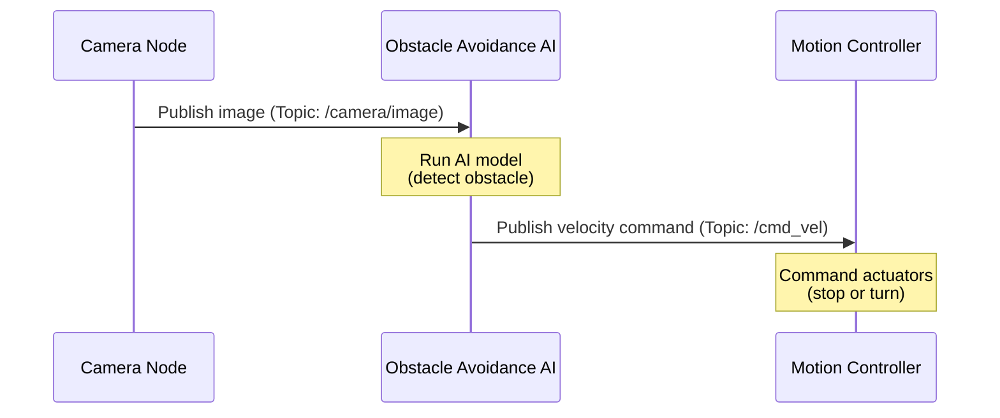
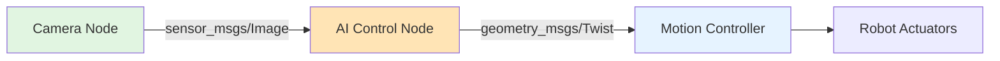

# Chapter 2: Python Agents with rclpy

## Python as the AI Control Layer

In Chapter 1, you learned about ROS 2's communication patterns (nodes, topics, services, actions). Now you'll see how to **implement** these patterns in Python using **rclpy** (ROS Client Library for Python).

**Why Python for AI Control?**

- **AI/ML Ecosystem**: Python is the lingua franca of AI (PyTorch, TensorFlow, scikit-learn)
- **Rapid Prototyping**: Faster iteration cycles compared to C++
- **Readable Code**: AI engineers can focus on logic, not low-level memory management
- **ROS 2 Support**: rclpy provides full access to ROS 2 features

**The Role of rclpy**:

rclpy is the bridge between your AI decision-making code and the robot's ROS 2 system. It allows you to:
- Subscribe to sensor data (camera images, IMU readings, joint states)
- Publish commands to actuators (velocity commands, joint positions)
- Call services for one-time operations (inverse kinematics, state queries)
- Use actions for long-running tasks (navigation, grasping)

:::tip Mental Model
Think of rclpy as the **API** that lets your AI "brain" talk to the robot's "nervous system" (ROS 2).
:::

---

## ROS 2 Node Lifecycle

Every ROS 2 Python program follows a standard lifecycle. Understanding this pattern is essential for writing AI control nodes.

**The Four Stages**:

1. **Initialize**: Set up the ROS 2 context
2. **Create Node**: Instantiate your node with publishers, subscribers, services
3. **Spin**: Process incoming messages and callbacks
4. **Shutdown**: Clean up resources

**Conceptual Pattern**:

```python
import rclpy
from rclpy.node import Node

def main():
    # 1. Initialize ROS 2
    rclpy.init()

    # 2. Create your AI control node
    node = MyAIControlNode()

    # 3. Spin (process messages)
    rclpy.spin(node)

    # 4. Shutdown
    node.destroy_node()
    rclpy.shutdown()
```

**Key Insight**: `rclpy.spin()` is a blocking call that processes messages continuously. All your AI logic runs in **callbacks** triggered by incoming data (subscribers) or timer events.

---

## Publishers: Sending Commands

**Definition**: A **publisher** sends messages to a topic. This is how your AI node commands the robot.

**Use Case**: Your vision AI detects an obstacle and wants to stop the robot by publishing a velocity command.

**Minimal Code Example**:

```python
from geometry_msgs.msg import Twist

class AIControlNode(Node):
    def __init__(self):
        super().__init__('ai_control_node')

        # Create a publisher for velocity commands
        self.cmd_pub = self.create_publisher(
            Twist,           # Message type
            '/cmd_vel',      # Topic name
            10               # Queue size
        )

    def stop_robot(self):
        """Publish a zero-velocity command to stop the robot"""
        msg = Twist()
        msg.linear.x = 0.0   # Stop forward motion
        msg.angular.z = 0.0  # Stop rotation
        self.cmd_pub.publish(msg)
```

**Breakdown**:
- `create_publisher(MessageType, topic_name, queue_size)`: Creates a publisher
- `Twist`: Standard ROS 2 message for velocity commands (linear and angular)
- `publish(msg)`: Sends the message to all subscribers

**Real-World Flow**:
1. AI detects obstacle in camera image
2. AI node calls `stop_robot()`
3. `/cmd_vel` topic receives the message
4. Motion controller node subscribes to `/cmd_vel` and stops actuators

---

## Subscribers: Receiving Sensor Data

**Definition**: A **subscriber** listens to a topic and triggers a callback function when a message arrives.

**Use Case**: Your AI node needs to process camera images for object detection.

**Minimal Code Example**:

```python
from sensor_msgs.msg import Image

class VisionAINode(Node):
    def __init__(self):
        super().__init__('vision_ai_node')

        # Create a subscriber for camera images
        self.image_sub = self.create_subscription(
            Image,                 # Message type
            '/camera/image',       # Topic name
            self.image_callback,   # Callback function
            10                     # Queue size
        )

    def image_callback(self, msg):
        """Called every time a new image arrives"""
        # msg.data contains raw image bytes
        # msg.width, msg.height contain dimensions

        # Run AI inference here
        detected_objects = self.run_object_detection(msg)

        # Take action based on detections
        if 'obstacle' in detected_objects:
            self.trigger_stop()
```

**Breakdown**:
- `create_subscription(MessageType, topic_name, callback, queue_size)`: Creates a subscriber
- `image_callback(msg)`: Your function that processes each incoming message
- Callback runs **asynchronously** whenever a message arrives

**Key Insight**: Subscribers are **event-driven**. Your AI logic runs in response to sensor data, not in a continuous loop.

---

## AI Decision Making Example

Let's see how publishers and subscribers work together to create an AI-driven control loop.

**Scenario**: A vision AI node detects obstacles and publishes velocity commands to avoid them.

```python
import rclpy
from rclpy.node import Node
from sensor_msgs.msg import Image
from geometry_msgs.msg import Twist

class ObstacleAvoidanceAI(Node):
    def __init__(self):
        super().__init__('obstacle_avoidance_ai')

        # Subscribe to camera
        self.image_sub = self.create_subscription(
            Image,
            '/camera/image',
            self.process_image,
            10
        )

        # Publish velocity commands
        self.cmd_pub = self.create_publisher(Twist, '/cmd_vel', 10)

    def process_image(self, image_msg):
        """AI decision pipeline: Image → Detection → Action"""

        # 1. Run AI model (conceptual)
        obstacle_detected = self.detect_obstacle(image_msg)

        # 2. Make decision
        cmd = Twist()
        if obstacle_detected:
            # Stop forward motion
            cmd.linear.x = 0.0
            cmd.angular.z = 0.5  # Turn to avoid
        else:
            # Move forward
            cmd.linear.x = 0.5
            cmd.angular.z = 0.0

        # 3. Publish command
        self.cmd_pub.publish(cmd)

    def detect_obstacle(self, image_msg):
        """Run your AI model here (PyTorch, TensorFlow, etc.)"""
        # Placeholder for actual AI inference
        return False  # Replace with real detection logic
```

**Data Flow**:



:::tip Integration Pattern
This is the **canonical AI-to-robot pattern**: Subscribe to sensors → Run AI inference → Publish commands. Almost every AI control node follows this structure.
:::

---

## Services: Request-Response Operations

**Definition**: A **service** allows your AI node to request a computation and wait for a result.

**Use Case**: Your motion planner needs to compute inverse kinematics (convert target position to joint angles).

**Minimal Code Example** (Client Side):

```python
from std_srvs.srv import Trigger

class MotionPlannerNode(Node):
    def __init__(self):
        super().__init__('motion_planner')

        # Create a service client
        self.reset_client = self.create_client(Trigger, '/reset_pose')

    def reset_robot(self):
        """Call the reset service and wait for response"""
        request = Trigger.Request()

        # Wait for service to be available
        self.reset_client.wait_for_service()

        # Call service (synchronous)
        future = self.reset_client.call_async(request)
        rclpy.spin_until_future_complete(self, future)

        response = future.result()
        if response.success:
            self.get_logger().info('Robot reset successful')
        else:
            self.get_logger().error(f'Reset failed: {response.message}')
```

**Breakdown**:
- `create_client(ServiceType, service_name)`: Creates a service client
- `call_async(request)`: Sends request and returns a future
- `spin_until_future_complete()`: Blocks until response arrives

**When to Use Services**:
- Discrete, one-time operations (not continuous data streams)
- Operations that require a response (e.g., "did the reset succeed?")
- Computations performed by specialized nodes (IK, collision checking)

---

## Bridging AI to Robot Motion

Let's combine everything into a complete example: an AI node that subscribes to a camera, runs object detection, and publishes motion commands.

**System Architecture**:



**Complete AI Node** (Conceptual):

```python
import rclpy
from rclpy.node import Node
from sensor_msgs.msg import Image
from geometry_msgs.msg import Twist

class HumanoidAIController(Node):
    def __init__(self):
        super().__init__('humanoid_ai_controller')

        # Subscribe to camera images
        self.create_subscription(Image, '/camera/image', self.on_image, 10)

        # Publish velocity commands
        self.cmd_pub = self.create_publisher(Twist, '/cmd_vel', 10)

        # AI model (placeholder)
        self.model = self.load_ai_model()

    def on_image(self, image_msg):
        """Main AI control loop: Perception → Decision → Action"""

        # 1. Perception: Run AI model on image
        detections = self.model.infer(image_msg)

        # 2. Decision: Plan motion based on detections
        cmd = self.plan_motion(detections)

        # 3. Action: Publish command to motion controller
        self.cmd_pub.publish(cmd)

    def plan_motion(self, detections):
        """Convert AI detections to robot commands"""
        cmd = Twist()

        if 'person' in detections:
            # Approach the person
            cmd.linear.x = 0.3
        elif 'obstacle' in detections:
            # Stop and turn
            cmd.linear.x = 0.0
            cmd.angular.z = 0.5
        else:
            # Explore
            cmd.linear.x = 0.5

        return cmd

    def load_ai_model(self):
        """Load your PyTorch/TensorFlow model here"""
        pass  # Replace with actual model loading

def main():
    rclpy.init()
    node = HumanoidAIController()
    rclpy.spin(node)
    node.destroy_node()
    rclpy.shutdown()
```

**Key Takeaway**: This pattern—**subscribe to sensors, run AI, publish commands**—is the foundation of AI-controlled robotics. The AI logic lives in the callbacks, and ROS 2 handles all the communication.

---

## Key Takeaways

✅ **rclpy** is the Python bridge between AI software and ROS 2 systems

✅ **Publishers** send commands (e.g., velocity, joint positions) to control the robot

✅ **Subscribers** receive sensor data (e.g., images, IMU) and trigger AI callbacks

✅ **Services** are for discrete, request-response operations (e.g., IK, state queries)

✅ **AI Control Pattern**: Subscribe to sensors → Run inference → Publish commands

✅ All AI logic runs in **callbacks** (event-driven, not loop-based)

✅ `rclpy.spin()` continuously processes messages and triggers your callbacks

---

## Prerequisites for Chapter 3

Before moving to Chapter 3, ensure you can:

- ✅ Identify the purpose of `create_publisher()` and `create_subscription()` in rclpy code
- ✅ Explain how a subscriber callback triggers AI logic in response to sensor data
- ✅ Describe the AI control pattern: perception → decision → action
- ✅ Understand when to use topics vs services in Python code

:::info Ready for Robot Structure?
In [Chapter 3: Humanoid Robot Description (URDF)](./03-urdf-humanoids.md), you'll learn how URDF files define a robot's physical structure (links, joints, sensors) and their role in simulation and control.
:::

---

## Further Reading

- [rclpy API Documentation](https://docs.ros.org/en/humble/p/rclpy/)
- [Writing a Simple Publisher and Subscriber (Python)](https://docs.ros.org/en/humble/Tutorials/Beginner-Client-Libraries/Writing-A-Simple-Py-Publisher-And-Subscriber.html)
- [Understanding ROS 2 Services](https://docs.ros.org/en/humble/Tutorials/Beginner-Client-Libraries/Writing-A-Simple-Py-Service-And-Client.html)
- [ROS 2 Python Examples](https://github.com/ros2/examples/tree/humble/rclpy)
