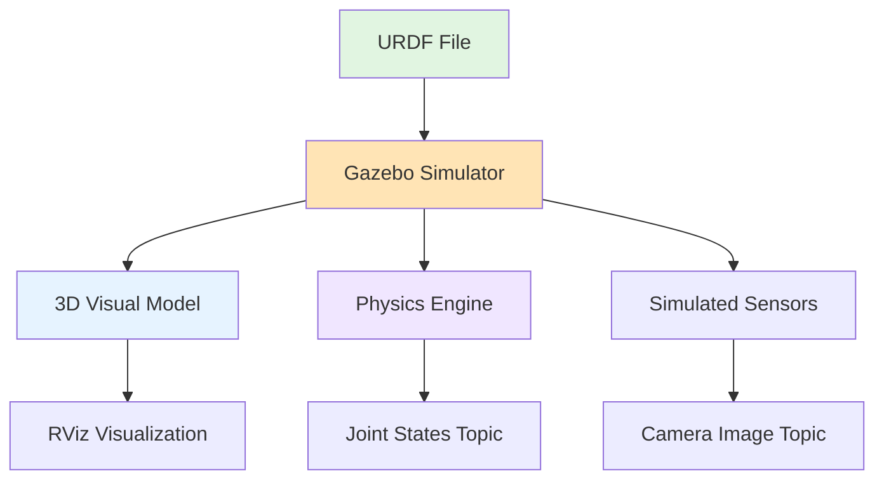
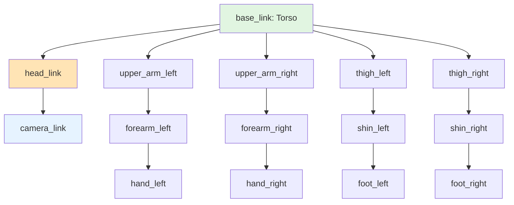

# Chapter 3: Humanoid Robot Description (URDF)

## What is URDF?

**URDF** stands for **Unified Robot Description Format**. It's an XML-based file format that defines:

- **Robot Structure**: The physical parts (links) and how they connect (joints)
- **Geometry**: Visual appearance and collision shapes for simulation
- **Physics Properties**: Mass, inertia, friction coefficients
- **Sensors and Actuators**: Cameras, IMUs, joint motors

**Why URDF Matters for AI Engineers**:

In Chapters 1-2, you learned how ROS 2 enables communication between AI software and robot hardware. But how does the system know:
- Where the robot's camera is located relative to its torso?
- What joints can move and what their limits are?
- What the robot "looks like" in simulation?

**URDF provides the answer**: It's the blueprint that tells ROS 2 (and tools like Gazebo, RViz, MoveIt) about the robot's physical structure.

:::tip Why AI Engineers Need URDF
When your AI plans motions ("move the arm to grab the cup"), it must respect:
- **Joint limits**: The elbow can't bend backward
- **Kinematic chains**: Moving the wrist affects the gripper position
- **Sensor locations**: Camera field of view depends on head position

URDF encodes all of this.
:::

---

## Links: Robot Body Parts

**Definition**: A **link** is a rigid body part of the robot. Think of it as a single, solid piece.

**Examples in a Humanoid Robot**:
- `base_link`: The torso (root of the kinematic tree)
- `head_link`: The head
- `upper_arm_left`: Left upper arm
- `forearm_right`: Right forearm
- `hand_left`: Left gripper/hand
- `camera_link`: Camera sensor (treated as a link)

**Key Properties**:
- **Visual Geometry**: How the link looks (mesh file or primitive shapes)
- **Collision Geometry**: Simplified shape for collision detection
- **Inertial Properties**: Mass and inertia tensor (for physics simulation)

**Simplified XML Example** (Torso Link):

```xml
<link name="base_link">
  <!-- Visual: What you see in RViz/Gazebo -->
  <visual>
    <geometry>
      <box size="0.3 0.2 0.5"/>  <!-- Width, Depth, Height in meters -->
    </geometry>
    <material name="gray">
      <color rgba="0.5 0.5 0.5 1.0"/>
    </material>
  </visual>

  <!-- Collision: For physics simulation -->
  <collision>
    <geometry>
      <box size="0.3 0.2 0.5"/>  <!-- Same as visual for simplicity -->
    </geometry>
  </collision>

  <!-- Inertial: Mass and inertia (required for dynamics) -->
  <inertial>
    <mass value="10.0"/>  <!-- 10 kg torso -->
    <inertia ixx="1.0" ixy="0.0" ixz="0.0"
             iyy="1.0" iyz="0.0" izz="1.0"/>
  </inertial>
</link>
```

**Key Insight**: Links are the "bones" of the robot. They don't move relative to themselves—movement happens at **joints**.

---

## Joints: Connections with Constraints

**Definition**: A **joint** connects two links and defines how they can move relative to each other.

**Every joint has**:
- **Parent Link**: The "base" link (e.g., torso)
- **Child Link**: The moving link (e.g., upper arm)
- **Joint Type**: How the child can move (revolute, prismatic, fixed)
- **Axis**: Direction of rotation or translation
- **Limits**: Min/max position, velocity, effort (torque)

**Simplified XML Example** (Shoulder Joint):

```xml
<joint name="shoulder_left_joint" type="revolute">
  <!-- Parent and child links -->
  <parent link="base_link"/>
  <child link="upper_arm_left"/>

  <!-- Origin: Where the child is attached relative to parent -->
  <origin xyz="0.0 0.2 0.4" rpy="0 0 0"/>
  <!-- xyz: X, Y, Z offset in meters -->
  <!-- rpy: Roll, Pitch, Yaw orientation in radians -->

  <!-- Axis: Direction of rotation (Y-axis = pitch) -->
  <axis xyz="0 1 0"/>

  <!-- Limits: Physical constraints -->
  <limit lower="-1.57" upper="1.57"  <!-- -90° to +90° in radians -->
         effort="50.0"                <!-- Max torque in Nm -->
         velocity="2.0"/>              <!-- Max speed in rad/s -->
</joint>
```

**Breakdown**:
- `parent="base_link"`: Shoulder is attached to torso
- `child="upper_arm_left"`: Upper arm moves relative to torso
- `type="revolute"`: Rotational joint (like a hinge)
- `axis="0 1 0"`: Rotates around Y-axis (pitch motion)
- `limit`: Arm can swing from -90° to +90° (forward and backward)

**Real-World Analogy**: If the torso is the "trunk" of a tree, joints are the "branches" that split off and move.

---

## Joint Types Explained

ROS 2 URDF supports several joint types. Here are the most important for humanoid robots:

### 1. Revolute (Rotational with Limits)

**Use Case**: Shoulder, elbow, hip, knee
**Degrees of Freedom**: 1 (rotation around one axis)
**Limits**: Yes (e.g., elbow can't bend backward)

```xml
<joint name="elbow_joint" type="revolute">
  <parent link="upper_arm"/>
  <child link="forearm"/>
  <axis xyz="0 1 0"/>  <!-- Pitch rotation -->
  <limit lower="0.0" upper="2.5"/>  <!-- 0° to 143° -->
</joint>
```

### 2. Continuous (Unlimited Rotation)

**Use Case**: Wheels, rotating sensors (360° head rotation)
**Degrees of Freedom**: 1 (rotation around one axis)
**Limits**: None

```xml
<joint name="head_yaw_joint" type="continuous">
  <parent link="torso"/>
  <child link="head"/>
  <axis xyz="0 0 1"/>  <!-- Yaw (spin around Z-axis) -->
</joint>
```

### 3. Prismatic (Linear Motion)

**Use Case**: Extending telescoping limbs, linear actuators
**Degrees of Freedom**: 1 (translation along one axis)
**Limits**: Yes (min/max extension distance)

```xml
<joint name="gripper_prismatic" type="prismatic">
  <parent link="hand"/>
  <child link="gripper_finger"/>
  <axis xyz="1 0 0"/>  <!-- Slide along X-axis -->
  <limit lower="0.0" upper="0.05"/>  <!-- 0 to 5 cm -->
</joint>
```

### 4. Fixed (No Motion)

**Use Case**: Attaching sensors (camera, IMU) rigidly to a link
**Degrees of Freedom**: 0 (no movement)

```xml
<joint name="camera_joint" type="fixed">
  <parent link="head"/>
  <child link="camera_link"/>
  <origin xyz="0.05 0 0.1"/>  <!-- Camera 10 cm above head center -->
</joint>
```

**Comparison Table**:

| Joint Type | Motion | Limits | Example |
|------------|--------|--------|---------|
| **Revolute** | Rotation | Yes | Elbow, knee |
| **Continuous** | Rotation | No | Spinning wheel, 360° head |
| **Prismatic** | Translation | Yes | Gripper fingers, telescoping arm |
| **Fixed** | None | N/A | Camera mount, IMU attachment |

---

## Sensors in URDF

Sensors (cameras, LiDAR, IMUs) are modeled as **links** with **fixed joints** to their parent link.

**Example: Camera on Head**

```xml
<!-- Camera is a link (even though it's a sensor) -->
<link name="camera_link">
  <visual>
    <geometry>
      <box size="0.02 0.05 0.02"/>  <!-- Small box for camera body -->
    </geometry>
    <material name="black"/>
  </visual>
</link>

<!-- Fixed joint attaches camera to head -->
<joint name="camera_joint" type="fixed">
  <parent link="head_link"/>
  <child link="camera_link"/>
  <origin xyz="0.08 0 0.05" rpy="0 0 0"/>  <!-- 8 cm forward, 5 cm up -->
</joint>
```

**How This Maps to ROS 2**:

- The camera publishes images to `/camera/image` (topic from Chapter 1)
- ROS 2 uses **TF (Transform Tree)** to track where `camera_link` is in 3D space
- Your AI knows: "If the head rotates 30°, the camera view changes accordingly"

**Key Insight**: Sensors in URDF define **where** they are on the robot. The ROS 2 node for the sensor publishes data to a topic, but URDF tells the system the sensor's spatial location.

---

## URDF Role in Simulation

URDF is the bridge between your AI code and simulated robot environments (Gazebo, Isaac Sim, MuJoCo).

**What Simulators Use URDF For**:

1. **Visual Rendering**: Display the robot in 3D (uses `<visual>` tags)
2. **Collision Detection**: Detect when robot parts collide with objects (uses `<collision>` tags)
3. **Physics Simulation**: Compute forces, torques, gravity effects (uses `<inertial>` tags)
4. **Sensor Simulation**: Render camera images, generate IMU data based on sensor link positions

**Example Flow**:



**Real-World Workflow**:

1. **Develop**: Define robot in URDF
2. **Simulate**: Load URDF into Gazebo
3. **Test AI**: Run your Python rclpy control nodes (from Chapter 2)
4. **Validate**: Ensure AI works before deploying to real hardware

:::tip Sim-to-Real Transfer
URDF makes it possible to train AI in simulation (safe, fast, cheap) and deploy to real robots. The same URDF describes both the simulated and real robot.
:::

---

## URDF Role in Control

Motion planning and control libraries (like **MoveIt**) use URDF to:

1. **Compute Kinematics**: Forward kinematics (joint angles → end effector position) and inverse kinematics (target position → joint angles)
2. **Respect Joint Limits**: Ensure planned motions don't violate `<limit>` constraints
3. **Collision Avoidance**: Use `<collision>` geometry to avoid self-collisions (e.g., arm hitting torso)
4. **Path Planning**: Find trajectories that move the robot from A to B safely

**Example: Inverse Kinematics (IK)**

Your AI says: "Move the gripper to (x=0.5, y=0.3, z=1.0)"

MoveIt uses URDF to:
1. Identify the kinematic chain: `base_link → shoulder → elbow → wrist → gripper`
2. Compute joint angles (θ₁, θ₂, θ₃, θ₄) that place the gripper at (0.5, 0.3, 1.0)
3. Check if those angles violate joint limits (from `<limit>` tags)
4. Return the solution or report "unreachable target"

**Key Insight**: URDF is the source of truth for "what motions are physically possible" for the robot.

---

## Reading a Humanoid URDF

Let's walk through a simplified humanoid URDF to see how everything fits together.

**Simplified Humanoid Structure**:

```
base_link (torso)
├── head_link (via head_joint, revolute)
│   └── camera_link (via camera_joint, fixed)
├── upper_arm_left (via shoulder_left_joint, revolute)
│   └── forearm_left (via elbow_left_joint, revolute)
│       └── hand_left (via wrist_left_joint, revolute)
├── upper_arm_right (via shoulder_right_joint, revolute)
│   └── forearm_right (via elbow_right_joint, revolute)
│       └── hand_right (via wrist_right_joint, revolute)
├── thigh_left (via hip_left_joint, revolute)
│   └── shin_left (via knee_left_joint, revolute)
│       └── foot_left (via ankle_left_joint, revolute)
└── thigh_right (via hip_right_joint, revolute)
    └── shin_right (via knee_right_joint, revolute)
        └── foot_right (via ankle_right_joint, revolute)
```

**Step-by-Step Analysis**:

1. **Root Link**: `base_link` (torso) is the root—everything else is defined relative to it
2. **Head Chain**: Torso → Head (revolute joint) → Camera (fixed joint)
3. **Arm Chains**: Torso → Upper Arm → Forearm → Hand (all revolute joints)
4. **Leg Chains**: Torso → Thigh → Shin → Foot (all revolute joints)

**When You See a URDF**:

- **Count Links**: How many rigid body parts? (Links = parts)
- **Count Joints**: How many moving connections? (Joints = degrees of freedom)
- **Identify Sensors**: Look for `fixed` joints with `_camera`, `_imu`, `_lidar` in names
- **Check Limits**: Read `<limit>` tags to understand motion constraints

**Conceptual Diagram** (Humanoid Kinematic Tree):



:::tip Practical Skill
When working with a new humanoid robot, always:
1. Open its URDF file
2. Identify the root link (`base_link` or `torso`)
3. Trace the kinematic chains (arm, leg, head)
4. Note joint types and limits
5. Find sensor links (camera, IMU)

This gives you a complete mental model of the robot's structure.
:::

---

## Key Takeaways

✅ **URDF** defines a robot's structure (links, joints), geometry, and physics properties

✅ **Links** are rigid body parts (torso, arms, legs, head)

✅ **Joints** connect links and define motion constraints (revolute, prismatic, fixed)

✅ **Joint Types**: Revolute (limited rotation), Continuous (unlimited rotation), Prismatic (linear), Fixed (no motion)

✅ **Sensors** are modeled as links with fixed joints to parent links

✅ **Simulation Role**: URDF drives 3D visualization, physics, and sensor simulation in Gazebo/RViz

✅ **Control Role**: Motion planning (MoveIt) uses URDF for kinematics, limits, and collision avoidance

✅ **Reading URDF**: Trace the kinematic tree from root link, identify joint types, check limits

---

## Module 1 Complete!

🎉 **Congratulations!** You've completed Module 1: The Robotic Nervous System (ROS 2).

**You now understand**:
- ✅ **Chapter 1**: ROS 2 architecture (nodes, topics, services, actions)
- ✅ **Chapter 2**: Python rclpy for AI control (publishers, subscribers, services)
- ✅ **Chapter 3**: URDF for robot structure (links, joints, sensors, simulation)

**What You Can Do Now**:
1. **Read Robot Code**: You can interpret ROS 2 Python codebases and understand system architectures
2. **Design AI Integrations**: You know how to structure AI agents that control robot actuators
3. **Understand Simulations**: You can navigate Gazebo/RViz and interpret robot models
4. **Plan Motions**: You understand the role of kinematics, joint limits, and collision geometry

:::tip Next Steps

**Hands-On Practice**:
- Follow the [official ROS 2 tutorials](https://docs.ros.org/en/humble/Tutorials.html) to solidify concepts
- Try the [MoveIt tutorials](https://moveit.picknik.ai/humble/index.html) for motion planning
- Explore [Gazebo simulation](https://gazebosim.org/docs) with humanoid models

**Deepen Your Knowledge**:
- Study real humanoid URDFs (e.g., [PR2](https://github.com/PR2/pr2_common), [TIAGo](https://github.com/pal-robotics/tiago_robot))
- Build a simple AI control node that integrates a vision model with ROS 2
- Learn about **TF (Transform Tree)** for coordinate frame management

**Community Resources**:
- [ROS Discourse](https://discourse.ros.org/) - Ask questions
- [ROS Answers](https://answers.ros.org/) - Q&A platform
- [GitHub Discussions](https://github.com/your-org/physical-ai-book/discussions) - Book-specific help
:::

---

## Further Reading

### URDF Resources
- [URDF Official Documentation](https://wiki.ros.org/urdf)
- [URDF Tutorials](https://docs.ros.org/en/humble/Tutorials/Intermediate/URDF/URDF-Main.html)
- [Building a Visual Robot Model with URDF from Scratch](https://docs.ros.org/en/humble/Tutorials/Intermediate/URDF/Building-a-Visual-Robot-Model-with-URDF-from-Scratch.html)

### Simulation
- [Gazebo Classic Documentation](http://gazebosim.org/tutorials)
- [RViz User Guide](https://docs.ros.org/en/humble/Tutorials/Intermediate/RViz/RViz-User-Guide/RViz-User-Guide.html)

### Motion Planning
- [MoveIt 2 Documentation](https://moveit.picknik.ai/humble/index.html)
- [Understanding Inverse Kinematics](https://moveit.picknik.ai/humble/doc/examples/kinematics/kinematics.html)

### Humanoid Robotics
- [Humanoids in ROS](https://wiki.ros.org/Robots)
- [Example Humanoid URDFs](https://github.com/ros/robot_state_publisher/tree/humble/test)

---

**Thank you for completing Module 1!** We look forward to seeing you apply these concepts to building Physical AI systems. 🤖
